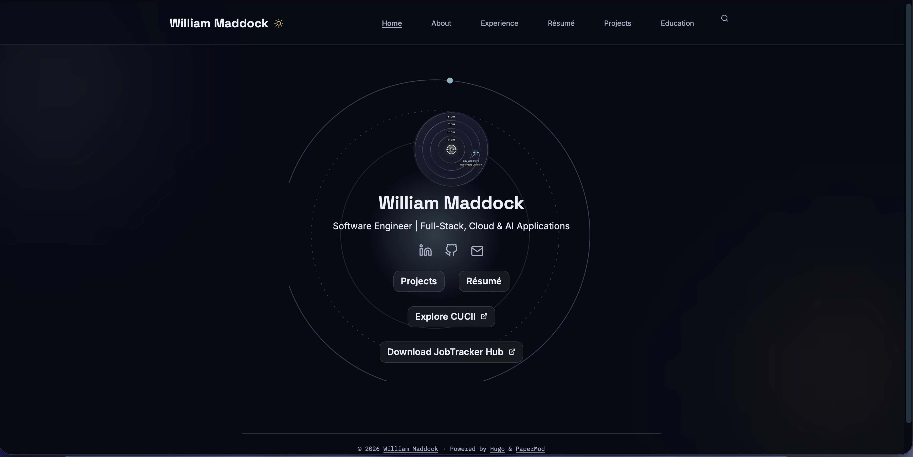

# Personal Portfolio Site: A Meta Adventure in Self-Promotion

[](https://willmaddock.github.io/dev/)

Welcome to my personal portfolio site! This is a fast, responsive static site built with [Hugo](https://gohugo.io/) and the [PaperMod](https://github.com/adityatelange/hugo-PaperMod) theme. It's deployed on GitHub Pages and serves as a showcase for my skills, projects, experience, education, and certifications in software engineering, data science, and cloud computing. 

Think of it as a meta masterpiece: a site that documents my work while demonstrating my web development prowess. It's professional yet playful, with searchable content, embedded media, and even a self-referential project page (because why not?).

Live site: [willmaddock.github.io/dev](https://willmaddock.github.io/dev)

## Features

- **Responsive Design**: Looks great on any device, thanks to PaperMod's flexible theme.
- **Search Functionality**: Powered by Fuse.js—quickly find content like projects or skills.
- **Custom Navigation**: Easy access to sections: About, Experience, Resume, Projects, Education, and Search.
- **Embedded Media**: Includes PDFs (e.g., resumes, reports), images, and links to external repos/tools.
- **Meta Fun**: Self-documenting elements, like a project page about the site itself—recursion at its finest!
- **Automated Deployment**: GitHub Actions handles builds and deploys on every push to `main`.
- **Open-Source Ready**: Fork and customize it for your own portfolio.

## Technologies Used

- **Static Site Generator**: Hugo (Go-based for speed and simplicity).
- **Theme**: PaperMod (responsive and customizable Hugo theme).
- **Content**: Markdown files for easy editing, TOML for configuration.
- **Deployment**: GitHub Pages with GitHub Actions (YAML workflows for CI/CD).
- **Search**: Fuse.js integrated via PaperMod.
- **Version Control**: Git, with submodules for themes.
- **Other**: HTML/CSS/JS tweaks, SEO optimizations, and open-source best practices.

## Installation and Setup

To run this site locally or customize it for yourself:

### Prerequisites
- [Hugo](https://gohugo.io/installation/) (extended version recommended for SCSS support).
- Git.

### Steps
1. Clone the repository:
   ```bash
   git clone https://github.com/willmaddock/dev.git
   cd dev
   ```

2. Initialize and update submodules (for the PaperMod theme):
   ```bash
   git submodule update --init --recursive
   ```

3. Install Hugo if not already installed (e.g., on macOS via Homebrew):
   ```bash
   brew install hugo
   ```

4. Run the local server:
   ```bash
   hugo server
   ```
   Visit [http://localhost:1313/dev/](http://localhost:1313/dev/) in your browser. The `/dev/` path is the baseURL set in `hugo.toml`.

5. Make changes: Edit content in the `content/` directory (Markdown files), static assets in `static/`, or config in `hugo.toml`.

## Usage

- **Adding Content**: Create new Markdown files in `content/projects/`, `content/experience/`, etc. Follow the frontmatter format (e.g., title, date, tags).
- **Customizing Theme**: Modify layouts or styles in `themes/PaperMod/` (but consider forking the theme for updates).
- **Building the Site**: Run `hugo` to generate static files in `public/`.
- **Fun Tip**: Add your own "Easter eggs" like meta references to keep it entertaining!

## Deployment

This site deploys automatically to GitHub Pages via GitHub Actions:

1. Push changes to the `main` branch.
2. The workflow in `.github/workflows/hugo.yaml` builds the site with Hugo and
   uploads `public/` as a Pages artifact, which GitHub then deploys directly —
   no `gh-pages` branch, no committed build output.
3. In **Settings → Pages → Build and deployment**, the **Source** must be set
   to **GitHub Actions** (not "Deploy from a branch") for this to take effect.
4. Custom domain? Update `hugo.toml` baseURL and add a CNAME file in `static/`.

For a local test build (matches what the workflow produces):
```bash
hugo --gc --minify
```
Output lands in `public/`, which is gitignored — nothing here needs to be
committed for deployment to work.

## Troubleshooting (Local Dev)

Common fixes when `hugo server` misbehaves locally — theme not updating, stale cache, port conflicts, etc.

**Theme changes not showing up / stale build**
```bash
# Clear Hugo's generated resource cache
rm -rf resources/_gen
rm -f .hugo_build.lock

# Then restart the server
hugo server -D
```

**Submodule (PaperMod theme) missing or empty**
```bash
# Re-fetch the theme submodule from scratch
git submodule update --init --recursive --force
```

**Port 1313 already in use**
```bash
# Find and kill whatever's holding the port (macOS/Linux)
lsof -ti:1313 | xargs kill -9

# Or just run on a different port
hugo server -D -p 1314
```

**CSS/JS edits not reflecting even after a hard refresh**
```bash
# Full clean rebuild — wipes cache, generated output, and lock file
rm -rf resources/_gen public .hugo_build.lock
hugo server -D --disableFastRender
```

**"command not found: hugo" after install**
```bash
# Confirm Hugo is installed and check version (extended needed for SCSS)
hugo version

# macOS: reinstall via Homebrew if missing
brew install hugo
```

**Drafts/future-dated posts not appearing locally**
```bash
# -D includes drafts, -F includes future-dated content
hugo server -D -F
```

**Nuclear option — wipe everything generated and start clean**
```bash
rm -rf resources/_gen public .hugo_build.lock
git submodule update --init --recursive --force
hugo server -D
```

**Localhost looks like plain/undecorated PaperMod, but production has the full "ORBITAL GLASS" look (ring animation, frosted-glass buttons, ambient background glow)**

Root cause (confirmed via git history): `assets/css/extended/glass-theme.css` — the
376-line custom theme layer that provides all of the above — was deleted from
the repo in commit `72cd490` ("Enjoy"). It was originally added in `9d1efad`
and last modified in `d4dfb73`.

Hugo assembles the site's final CSS bundle fresh on every build from
`license.css + core theme CSS + assets/css/extended/*.css` (see
`themes/PaperMod/layouts/partials/head.html` lines ~63-68). Once
`glass-theme.css` was deleted, any *fresh* build — including local
`hugo server` — stopped including it, producing the plain look.

Production kept looking correct only because an already-compiled CSS bundle
(`assets/css/stylesheet.<hash>.css`, built back when `glass-theme.css` still
existed) was sitting checked into `assets/css/` directly. That's not where
Hugo output belongs — it's supposed to land in `public/` and get regenerated
on every build, not be hand-committed under `assets/`. The stray file masked
the missing source, so local and live silently diverged.

```bash
# 1. Restore the missing source file from git history (last good commit)
git checkout d4dfb73 -- assets/css/extended/glass-theme.css

# 2. Remove the stray pre-built output files committed under assets/
#    (Hugo's own generated filenames — they don't belong here, and
#    having them here is what let this go unnoticed)
rm -f assets/css/stylesheet.*.css
rm -f assets/js/search.*.js

# 3. Clean rebuild and confirm localhost now matches production
rm -rf resources/_gen public .hugo_build.lock
hugo server -D
```

Commit the restored `glass-theme.css` and the two deletions. That's the
permanent fix — local no longer depends on a leftover compiled file to look
right.

## Repository Structure

- `content/`: All site pages (about.md, projects/, etc.).
- `static/`: Images, PDFs, resumes — the only place binary assets live now.
- `themes/PaperMod/`: Theme submodule.
- `.github/workflows/`: GitHub Actions for CI/CD.
- `hugo.toml`: Site configuration (menu, theme settings, search options).
- `README.md`: This file!
- `public/`: Hugo's build output. Gitignored — never committed, regenerated
  fresh by the Actions workflow on every deploy. The repo root itself is
  source only; nothing generated is tracked here.
- `.gitignore`: Ignores generated files like `public/`.

## Contributing

Feel free to fork and remix! If you'd like to contribute:
- Open an issue for suggestions.
- Submit a pull request with improvements.
- Licensed under MIT—see [LICENSE](LICENSE) for details.

## Acknowledgments

- Huge thanks to the [Hugo team](https://gohugo.io/) for an awesome SSG.
- Shoutout to [adityatelange](https://github.com/adityatelange) for the PaperMod theme.
- Props to GitHub for free hosting and Actions.
- Special mention to Grok (by xAI) for brainstorming ideas—AI-assisted creativity rocks!

If this project sparks joy or inspiration, star the repo or drop a note. Let's build cool things! 🚀

© 2025 William Maddock
