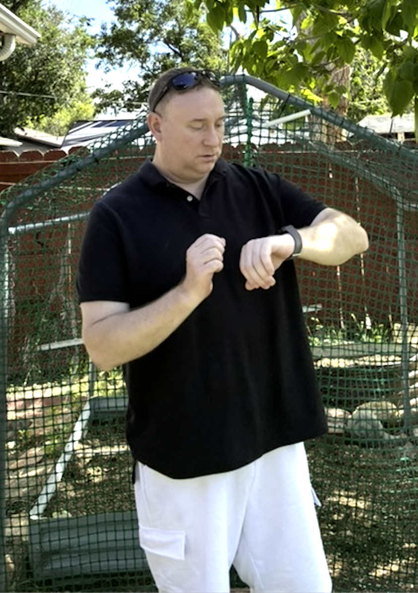

# 👋 William Maddock

I am a **software engineer and founder** with a B.S. in Computer Science from **Metropolitan State University of Denver**. I build full-stack web applications, browser-based AI tools, backend systems, data pipelines, mobile applications, and accessible technical documentation.

I am the **Founder and Lead Developer** of the **Cosmic Universalism Computational Intelligence Initiative (CUCII)**, where I own the product lifecycle from requirements and architecture through implementation, testing, documentation, deployment, and release governance.

  

## What I Build

- **Full-Stack Applications** — responsive interfaces, browser interactions, backend workflows, APIs, relational data, and cloud-backed storage.
- **AI-Facing Tools** — structured prompt systems, typed context configuration, deterministic generation, output review, and capability boundaries.
- **Tested Software** — automated unit and regression tests, validation, acceptance criteria, build verification, and controlled releases.
- **Data Products** — API collection, cleaning, analysis, predictive modeling, dashboards, and technical reporting.
- **Accessible Experiences** — semantic HTML, responsive layouts, keyboard-friendly controls, readable documentation, and transparent system behavior.

## Current Work: CUCII

CUCII is a public Astro and TypeScript platform for exploring Cosmic Universalism with general-purpose AI systems while preserving clear boundaries among:

1. **Empirical evidence**
2. **Cosmic Universalism as an authored framework**
3. **CUCII as a prompt-level conversational instrument**

The platform includes the CUCII Prompt Studio, the Cosmic Breath Explorer, CU-Time tools, research materials, media, documentation, and automated testing.

- <a href="https://willmaddock.github.io/CosmicUniversalismStatement/" target="_blank" rel="noopener noreferrer"><strong>Visit Cosmic Universalism</strong></a>
- <a href="https://willmaddock.github.io/CosmicUniversalismStatement/cu-intelligence/" target="_blank" rel="noopener noreferrer"><strong>Explore CUCII Prompt Studio</strong></a>
- <a href="https://github.com/willmaddock/CosmicUniversalismStatement" target="_blank" rel="noopener noreferrer"><strong>View the repository</strong></a>

## Technical Focus

- **Languages:** TypeScript, JavaScript, Python, Ruby, Kotlin, Rust, Java, SQL, Go
- **Web and Application Development:** Astro, Ruby on Rails, Hugo, Android Studio, semantic HTML, modern CSS, Markdown, SVG
- **Testing and Quality:** Vitest, RSpec, Capybara, unit testing, regression testing, validation, accessibility review
- **Data and Analytics:** Pandas, NumPy, scikit-learn, Plotly Dash, Folium, Jupyter Notebooks
- **Cloud and Delivery:** Git, GitHub, GitHub Actions, GitHub Pages, Docker, Kubernetes, AWS learning environments, Google Cloud Storage, Render
- **Leadership:** product ownership, technical documentation, Agile delivery, team coordination, release governance, and process improvement

## How I Work

I value inspectable systems, clear requirements, source-controlled changes, evidence-aware communication, and honest descriptions of uncertainty and technical limits. My projects emphasize practical implementation without presenting authored interpretations or AI-generated language as though they were independently verified facts.

## Connect

- <a href="https://www.linkedin.com/in/willmaddockcs/" target="_blank" rel="noopener noreferrer">LinkedIn</a>
- <a href="https://github.com/willmaddock/" target="_blank" rel="noopener noreferrer">GitHub</a>
- <a href="../experience/">Experience</a>
- <a href="../projects/">Projects</a>
- <a href="../resume/">Résumé</a>
