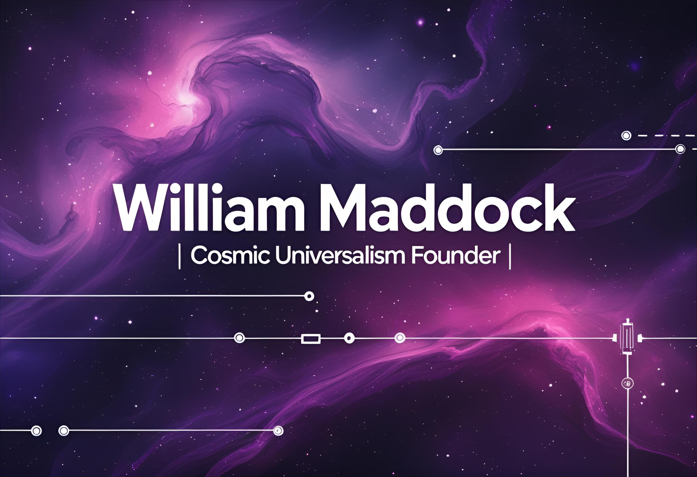

  

Cosmic Universalism is a computational intelligence initiative that I founded to explore ethical, secure, and globally accessible software infrastructure. Our mission is to integrate technical excellence with responsible innovation—spanning low-level systems programming, scalable cloud ops, and accessible tooling for inclusive technologies.

👉 <a href="https://willmaddock.github.io/CosmicUniversalismStatement/cosmic_converter/v3_0_0/cosmic_breath_time_converter_v3_0_1.html" target="_blank" rel="noopener noreferrer">Explore the latest tool: Cosmic Breath Time Converter</a>

---

### 🧠 Core Focus Areas

- **Security-first Infrastructure**: Leveraging Rust and Kubernetes for safe, performant distributed systems.
- **Cloud-native Deployment**: Architecting across AWS with serverless, storage, and networking solutions.
- **Ethical AI Systems**: Building intelligent tools that respect privacy, transparency, and open access.

---

### 🛠️ Tech Stack

- **Languages**: Rust, Python
- **Platforms**: AWS, Kubernetes
- **Ops**: GitHub Actions, Infrastructure as Code, containerized microservices

---

### 🎓 Verified AWS Educate Credentials

| Badge | Credential Link |
|-------|------------------|
| Generative AI | <a href="https://www.credly.com/badges/07a07924-d4d3-417b-9e84-c289b9eea87a/linked_in_profile" target="_blank" rel="noopener noreferrer">View</a> |
| Machine Learning Foundations | <a href="https://www.credly.com/badges/6b6c699d-d3b5-458a-84cd-7bf1d65be0bd/linked_in_profile" target="_blank" rel="noopener noreferrer">View</a> |
| Web Builder | <a href="https://www.credly.com/badges/c430067b-6fbf-4186-883b-7db12ef41220/linked_in_profile" target="_blank" rel="noopener noreferrer">View</a> |
| Cloud Ops | <a href="https://www.credly.com/badges/d1e047de-f420-4d45-9f88-10136bced725/linked_in_profile" target="_blank" rel="noopener noreferrer">View</a> |
| Compute | <a href="https://www.credly.com/badges/3b76a628-7423-457c-8198-c1b8127bf3a0/linked_in_profile" target="_blank" rel="noopener noreferrer">View</a> |
| Networking | <a href="https://www.credly.com/badges/807d3569-f378-4a96-9b6f-1dc6c6000abd/linked_in_profile" target="_blank" rel="noopener noreferrer">View</a> |
| Security | <a href="https://www.credly.com/badges/5cafef51-af7c-4c23-ab38-a4150dda8f45/linked_in_profile" target="_blank" rel="noopener noreferrer">View</a> |
| Serverless | <a href="https://www.credly.com/badges/db5b1006-562b-4ede-9d69-931ffed7631d/linked_in_profile" target="_blank" rel="noopener noreferrer">View</a> |
| Storage | <a href="https://www.credly.com/badges/c7b3345c-abde-4adc-818d-ffdb191403ab/linked_in_profile" target="_blank" rel="noopener noreferrer">View</a> |
| Cloud 101 | <a href="https://www.credly.com/badges/e573ab0a-7014-41ff-a9e0-69eea0c31eb3/linked_in_profile" target="_blank" rel="noopener noreferrer">View</a> |
| Databases | <a href="https://www.credly.com/badges/3fe9360b-b540-4cf1-a28f-fbfe30e8fb16/linked_in_profile" target="_blank" rel="noopener noreferrer">View</a> |

---

This initiative reflects my commitment to making transparent, ethical contributions to cloud computing and intelligent systems. I'm proud to pair theoretical grounding with hands-on delivery—and this project is a perfect snapshot of that balance.

