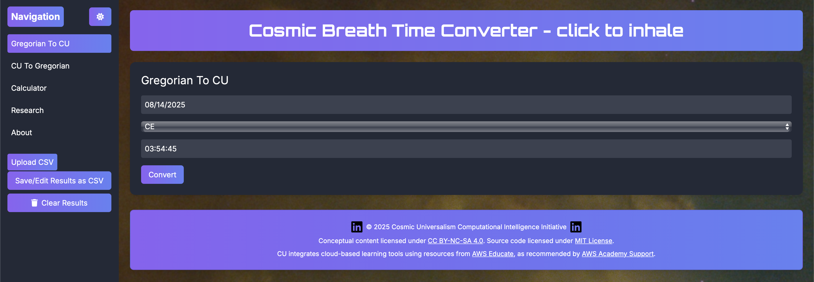

  

Founded on **December 27, 2024**, I lead the **Cosmic Universalism Computational Intelligence Initiative** as its founder and Central Point of Contact (CPOC), developing ethical, scalable cloud-native systems as part of my B.S. in Computer Science (expected 2025) at MSU Denver. Published on GitHub May 16, 2025, this initiative uses Rust, Kubernetes, and AWS to create secure, accessible tools for global impact.

👉 <a href="https://willmaddock.github.io/CosmicUniversalismStatement/cosmic_converter/v3_0_0/cosmic_breath_time_converter_v3_0_1.html" target="_blank" rel="noopener noreferrer"><strong>Explore the Cosmic Breath Time Converter</strong></a>  
👉 <a href="https://github.com/willmaddock/CosmicUniversalismStatement" target="_blank" rel="noopener noreferrer"><strong>View the GitHub Repository</strong></a>

---

### 🔍 Project Highlights

- Founded an initiative to build secure, ethical systems using **Rust**, **Kubernetes**, and **AWS**.
- Developed the Cosmic Breath Time Converter (v3.0.1), enabling conversions from Gregorian to Cosmic Universalism, NASA, and Big Bang time.
- Promoted open-source collaboration and ethical AI principles for global accessibility.
- Leveraged AWS Educate credentials to enhance cloud architecture and deployment.

---

### 📦 My Role: Founder and Central Point of Contact (CPOC)

- **Vision and Leadership**: Established the initiative’s mission for ethical, scalable systems.
- **Central Point of Contact**: Coordinated AWS integrations and communications, as documented in <a href="https://github.com/willmaddock/CosmicUniversalismStatement/blob/main/Docs/aws_emails.md" target="_blank" rel="noopener noreferrer">aws_emails.md</a>.
- **Development**: Built tools like the Cosmic Breath Time Converter using Rust and AWS.
- **Collaboration**: Managed open-source contributions via GitHub, ensuring code quality.
- **Education**: Applied AWS Educate training to architect secure cloud solutions.

This role strengthened my skills in **cloud architecture**, **systems programming**, and **ethical AI**.

---

### 👥 Contributors and Credits

A solo-led initiative with growing open-source contributions. Licensed under the <a href="https://creativecommons.org/licenses/by-nc-sa/4.0/" target="_blank" rel="noopener noreferrer">Creative Commons Attribution-NonCommercial-ShareAlike 4.0</a>.

---

### ✨ Key Features

The initiative delivers innovative tools, with the Cosmic Breath Time Converter (v3.0.1) as a flagship:

1. **Cosmic Breath Time Converter (v3.0.1)**: Converts Gregorian time to Cosmic Universalism time, NASA time, and Big Bang time, integrating astronomical data [<a href="https://github.com/willmaddock/CosmicUniversalismStatement/blob/main/cosmic_converter/v3_0_0/cosmic_breath_time_converter_v3_0_1.html" target="_blank" rel="noopener noreferrer">source</a>].
2. **Secure Infrastructure**: Rust-based systems for performance and safety.
3. **Cloud-Native Deployment**: Scalable microservices on AWS with Kubernetes.
4. **Ethical AI**: Privacy-focused, transparent AI tools.
5. **Open-Source Access**: Freely available code for community contributions.

**Integrations**: AWS (Lambda, S3, ECS), Kubernetes, GitHub Actions, Rust, Python.

---

### 🛠️ Technologies Used

- **Languages**: Rust, Python
- **Platforms**: AWS, Kubernetes
- **Tools**: GitHub Actions, Infrastructure as Code, Docker
- **Methodologies**: Agile, DevOps
- **Documentation**: <a href="https://github.com/willmaddock/CosmicUniversalismStatement/blob/main/README.md" target="_blank" rel="noopener noreferrer">README</a>, <a href="https://github.com/willmaddock/CosmicUniversalismStatement/blob/main/Docs/CU_Framework.md" target="_blank" rel="noopener noreferrer">Technical Documentation</a>

---

### 📁 Repository Contents

| Resource | Description |
|----------|-------------|
| <a href="https://github.com/willmaddock/CosmicUniversalismStatement/blob/main/README.md" target="_blank" rel="noopener noreferrer">README.md</a> | Interactive project overview and setup instructions |
| <a href="https://github.com/willmaddock/CosmicUniversalismStatement/blob/main/Docs/aws_emails.md" target="_blank" rel="noopener noreferrer">Docs/aws_emails.md</a> | AWS coordination and communications |
| <a href="https://github.com/willmaddock/CosmicUniversalismStatement/tree/main/Docs" target="_blank" rel="noopener noreferrer">Docs/</a> | Documentation directory |
| <a href="https://github.com/willmaddock/CosmicUniversalismStatement/blob/main/CosmicDecisionTrees/Cosmic%20Decision%20Tree%20v1.0.9.md" target="_blank" rel="noopener noreferrer">docs/Technical_Documentation.md</a> | Architecture and design details |
| <a href="https://github.com/willmaddock/CosmicUniversalismStatement/tree/main/CU_Alignment_Guides" target="_blank" rel="noopener noreferrer">docs/Cosmic_Breath_Time_Converter_Guide.md</a> | User guide for the Time Converter |
| <a href="https://github.com/willmaddock/CosmicUniversalismStatement/tree/main/LLMtrainingInegration" target="_blank" rel="noopener noreferrer">LLMtrainingIntegration/</a> | LLM training integration code |
| <a href="https://github.com/willmaddock/CosmicUniversalismStatement/tree/main/PyTorchTrainingFiles" target="_blank" rel="noopener noreferrer">PyTorchTrainingFiles/</a> | PyTorch training scripts |
| <a href="https://github.com/willmaddock/CosmicUniversalismStatement/tree/main/ResearchCodes" target="_blank" rel="noopener noreferrer">ResearchCodes/</a> | Research-related codebases |
| <a href="https://github.com/willmaddock/CosmicUniversalismStatement/tree/main/ResearchFiles" target="_blank" rel="noopener noreferrer">ResearchFiles/</a> | Research documents and resources |
| <a href="https://github.com/willmaddock/CosmicUniversalismStatement/tree/main/ResearchFiles/TimeLoadingFiles" target="_blank" rel="noopener noreferrer">ResearchFiles/TimeLoadingFiles/</a> | Time-related research data |
| <a href="https://github.com/willmaddock/CosmicUniversalismStatement/blob/main/cosmic_converter/v3_0_0/cosmic_breath_time_converter_v3_0_1.html" target="_blank" rel="noopener noreferrer">cosmic_converter/</a> | Source code for Cosmic Breath Time Converter (v3.0.1) |

---

### 📈 Project Rigor

The <a href="https://github.com/willmaddock/CosmicUniversalismStatement" target="_blank" rel="noopener noreferrer">GitHub repository</a> showcases:
- Detailed commit history since May 16, 2025.
- Comprehensive documentation, including an interactive README and technical guides.
- Open-source setup instructions for contributors.

**Setup**:
1. Clone: `git clone https://github.com/willmaddock/CosmicUniversalismStatement.git`
2. Configure AWS credentials and Kubernetes environment.
3. See <a href="https://github.com/willmaddock/CosmicUniversalismStatement/blob/main/ResearchFiles/CU-Post-Alignment-Capabilities.md" target="_blank" rel="noopener noreferrer">User Guide</a>.

---

### 🎓 AWS Educate Credentials

| Badge | Description | Credential Link |
|-------|-------------|------------------|
| <a href="https://www.credly.com/badges/07a07924-d4d3-417b-9e84-c289b9eea87a/linked_in_profile" target="_blank" rel="noopener noreferrer">Generative AI</a> | Expertise in AI-driven solutions | <a href="https://www.credly.com/badges/07a07924-d4d3-417b-9e84-c289b9eea87a/linked_in_profile" target="_blank" rel="noopener noreferrer">View</a> |
| <a href="https://www.credly.com/badges/6b6c699d-d3b5-458a-84cd-7bf1d65be0bd/linked_in_profile" target="_blank" rel="noopener noreferrer">Machine Learning Foundations</a> | Core ML concepts | <a href="https://www.credly.com/badges/6b6c699d-d3b5-458a-84cd-7bf1d65be0bd/linked_in_profile" target="_blank" rel="noopener noreferrer">View</a> |
| <a href="https://www.credly.com/badges/c430067b-6fbf-4186-883b-7db12ef41220/linked_in_profile" target="_blank" rel="noopener noreferrer">Web Builder</a> | Building web apps on AWS | <a href="https://www.credly.com/badges/c430067b-6fbf-4186-883b-7db12ef41220/linked_in_profile" target="_blank" rel="noopener noreferrer">View</a> |
| <a href="https://www.credly.com/badges/d1e047de-f420-4d45-9f88-10136bced725/linked_in_profile" target="_blank" rel="noopener noreferrer">Cloud Ops</a> | Managing cloud operations | <a href="https://www.credly.com/badges/d1e047de-f420-4d45-9f88-10136bced725/linked_in_profile" target="_blank" rel="noopener noreferrer">View</a> |
| <a href="https://www.credly.com/badges/3b76a628-7423-457c-8198-c1b8127bf3a0/linked_in_profile" target="_blank" rel="noopener noreferrer">Compute</a> | AWS compute services | <a href="https://www.credly.com/badges/3b76a628-7423-457c-8198-c1b8127bf3a0/linked_in_profile" target="_blank" rel="noopener noreferrer">View</a> |
| <a href="https://www.credly.com/badges/807d3569-f378-4a96-9b6f-1dc6c6000abd/linked_in_profile" target="_blank" rel="noopener noreferrer">Networking</a> | Cloud networking solutions | <a href="https://www.credly.com/badges/807d3569-f378-4a96-9b6f-1dc6c6000abd/linked_in_profile" target="_blank" rel="noopener noreferrer">View</a> |
| <a href="https://www.credly.com/badges/5cafef51-af7c-4c23-ab38-a4150dda8f45/linked_in_profile" target="_blank" rel="noopener noreferrer">Security</a> | Secure cloud architecture | <a href="https://www.credly.com/badges/5cafef51-af7c-4c23-ab38-a4150dda8f45/linked_in_profile" target="_blank" rel="noopener noreferrer">View</a> |
| <a href="https://www.credly.com/badges/db5b1006-562b-4ede-9d69-931ffed7631d/linked_in_profile" target="_blank" rel="noopener noreferrer">Serverless</a> | Serverless app development | <a href="https://www.credly.com/badges/db5b1006-562b-4ede-9d69-931ffed7631d/linked_in_profile" target="_blank" rel="noopener noreferrer">View</a> |
| <a href="https://www.credly.com/badges/c7b3345c-abde-4adc-818d-ffdb191403ab/linked_in_profile" target="_blank" rel="noopener noreferrer">Storage</a> | AWS storage solutions | <a href="https://www.credly.com/badges/c7b3345c-abde-4adc-818d-ffdb191403ab/linked_in_profile" target="_blank" rel="noopener noreferrer">View</a> |
| <a href="https://www.credly.com/badges/e573ab0a-7014-41ff-a9e0-69eea0c31eb3/linked_in_profile" target="_blank" rel="noopener noreferrer">Cloud 101</a> | Foundational cloud knowledge | <a href="https://www.credly.com/badges/e573ab0a-7014-41ff-a9e0-69eea0c31eb3/linked_in_profile" target="_blank" rel="noopener noreferrer">View</a> |
| <a href="https://www.credly.com/badges/3fe9360b-b540-4cf1-a28f-fbfe30e8fb16/linked_in_profile" target="_blank" rel="noopener noreferrer">Databases</a> | Managing cloud databases | <a href="https://www.credly.com/badges/3fe9360b-b540-4cf1-a28f-fbfe30e8fb16/linked_in_profile" target="_blank" rel="noopener noreferrer">View</a> |

---

### 🔗 Links and Resources

- <a href="https://github.com/willmaddock/CosmicUniversalismStatement" target="_blank" rel="noopener noreferrer">GitHub Repository</a>
- <a href="https://github.com/willmaddock/CosmicUniversalismStatement/tree/main/CU_Alignment_Guides" target="_blank" rel="noopener noreferrer">User Guide</a>
- <a href="https://github.com/willmaddock/CosmicUniversalismStatement/blob/main/README.md" target="_blank" rel="noopener noreferrer">Project README</a>
- <a href="https://willmaddock.github.io/CosmicUniversalismStatement/cosmic_converter/v3_0_0/cosmic_breath_time_converter_v3_0_1.html" target="_blank" rel="noopener noreferrer">Cosmic Breath Time Converter</a>
- <a href="https://github.com/willmaddock/CosmicUniversalismStatement/blob/main/Docs/aws_emails.md" target="_blank" rel="noopener noreferrer">AWS Communications</a>

Explore this initiative to see my leadership in ethical, cloud-native systems.