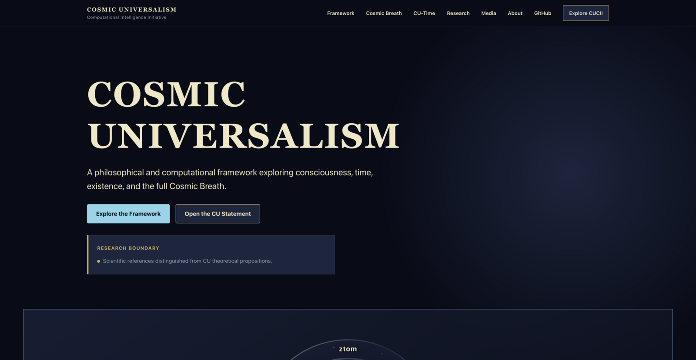

<p style="text-align:center;">
  <a href="https://willmaddock.github.io/CosmicUniversalismStatement/" target="_blank" rel="noopener noreferrer">
    
  </a>
</p>

Founded on **December 27, 2024**, the **Cosmic Universalism Computational Intelligence Initiative (CUCII)** is an open-source philosophical and computational project that I lead as **Founder & Lead Developer**.

The current public platform is no longer accurately described as a Rust, Kubernetes, or AWS deployment. It is a production **Astro and TypeScript static website** deployed through **GitHub Pages**, with interactive browser-based tools, typed content structures, accessibility-focused components, automated regression testing, and extensive technical documentation.

The project separates three layers that should not be collapsed together:

1. **Empirical references** — externally testable scientific observations and established context.
2. **Cosmic Universalism** — the authored philosophical, mathematical, and theoretical framework.
3. **CUCII** — the prompt-level system used to explore CU through analytical, role-play, or hybrid conversations on general-purpose AI platforms.

> **Research boundary:** Scientific references remain distinct from CU theoretical propositions. CUCII prompts do not retrain, unlock, permanently alter, or override an external AI model, its policies, memory, safety systems, capabilities, or technical architecture.

### 🚀 Explore the Live Project

- 👉 <a href="https://willmaddock.github.io/CosmicUniversalismStatement/" target="_blank" rel="noopener noreferrer"><strong>Open the Cosmic Universalism Website</strong></a>
- 👉 <a href="https://willmaddock.github.io/CosmicUniversalismStatement/cu-intelligence/" target="_blank" rel="noopener noreferrer"><strong>Explore the CUCII Prompt Studio</strong></a>
- 👉 <a href="https://willmaddock.github.io/CosmicUniversalismStatement/cosmic-breath/" target="_blank" rel="noopener noreferrer"><strong>Explore the Cosmic Breath</strong></a>
- 👉 <a href="https://willmaddock.github.io/CosmicUniversalismStatement/cu-time/" target="_blank" rel="noopener noreferrer"><strong>Explore CU-Time</strong></a>
- 👉 <a href="https://github.com/willmaddock/CosmicUniversalismStatement" target="_blank" rel="noopener noreferrer"><strong>View the GitHub Repository</strong></a>

---

### 🔍 Project Highlights

- Designed and launched an **eight-route production website** covering the framework, Cosmic Breath, CU-Time, research, media, project information, and CUCII.
- Built the **CUCII Prompt Studio**, a local browser-based tool that creates portable prompts for analytical, narrative, and hybrid AI conversations.
- Developed a typed **51-state Cosmic Breath Explorer** with direct state selection, guarded transitions, adaptive visuals, educational layers, and source-aware content.
- Maintained the **Cosmic Breath Time Converter v3.0.1** and supporting CU-Time documentation.
- Established a verified quality gate of **251 automated tests across 30 test files**.
- Built a successful production workflow with **Astro**, **Vitest**, **Git**, **GitHub Actions**, and **GitHub Pages**.
- Documented research boundaries that distinguish empirical evidence, CU mathematical models, CU theoretical propositions, and open questions.
- Created public media, technical manuals, implementation handoffs, source maps, release records, and recovery checkpoints.

---

### 📦 My Role: Founder & Lead Developer

My responsibilities span the full product lifecycle:

- **Product Direction** — define the project roadmap, public experience, terminology, and release priorities.
- **Architecture** — design typed registries, content structures, reusable Astro components, browser interactions, and static deployment workflows.
- **Development** — implement the public website, CUCII Prompt Studio, Cosmic Breath Explorer, CU-Time interfaces, research pages, and media presentation.
- **Testing** — maintain automated unit and regression tests, review failures, and verify production builds before release.
- **Governance** — preserve source provenance, approved terminology, research boundaries, capability boundaries, and versioned authority files.
- **Documentation** — create implementation manuals, technical guides, current-state handoffs, source maps, and public explanatory content.
- **Release Management** — use feature branches, review checkpoints, release tags, GitHub workflows, and rollback points to keep changes inspectable and recoverable.
- **Cross-Platform Evaluation** — test portable CUCII prompts across general-purpose AI platforms while documenting variability, limitations, and narrative boundaries.

This work has strengthened my skills in **full-stack product ownership**, **TypeScript architecture**, **AI workflow design**, **test automation**, **accessibility**, **technical writing**, and **evidence-aware software governance**.

---

### 🧠 CUCII Prompt Studio

The **CUCII Prompt Studio** is a configurable prompt-generation system that runs locally in the browser. Visitors can:

1. Choose a target AI platform and conversation purpose.
2. Select analytical, role-play, or hybrid behavior.
3. Choose a prepared menu, custom menu, or no menu.
4. Select a source pack, response preferences, output format, and alignment principles.
5. Add optional working context and constraints.
6. Generate and review a complete portable prompt.
7. Copy the prompt or download it as `.txt` or `.md`.
8. Paste it into a new conversation on the external AI platform of their choice.

The studio does **not** automatically submit prompts to an AI platform. Prompt settings are processed locally, and the first-release tool does not send entries to a Cosmic Universalism server or AI API or save prompt content by default.

#### CUCII alignment principles

- Verify before asserting.
- Separate evidence from interpretation.
- Name uncertainty and assumptions.
- Expose contradictions.
- Correct verified errors.
- Preserve approved CU terminology.
- Respect analytical and role-play modes.
- Protect user agency.
- Respect external platform policies.

---

### 🌌 Cosmic Breath Explorer

The Cosmic Breath section presents CU's proposed **3.108-trillion-year cycle**:

- **Expansion:** 2.8 trillion years, from sub-ztom to atom.
- **Compression:** 308 billion years, from btom to ztom.
- **Full cycle:** 3.108 trillion years.

The interactive explorer supports direct navigation across **51 TOM states** and displays each state's approved label, phase, quantum-state notation, duration estimate, CU description, and epistemic boundary. The observable-universe marker remains a contextual, non-selectable reference between compression-btom and compression-ctom.

These durations and structures are presented as **CU mathematical models or theoretical propositions**, not empirical measurements.

---

### ⏳ CU-Time and the Time Converter

The project includes the **Cosmic Breath Time Converter v3.0.1**, which provides Gregorian-to-CU-Time and reverse-conversion workflows using the converter's documented constants and calendar logic.

- <a href="https://willmaddock.github.io/CosmicUniversalismStatement/cosmic_converter/v3_0_0/cosmic_breath_time_converter_v3_0_1.html" target="_blank" rel="noopener noreferrer">Open the Cosmic Breath Time Converter</a>
- <a href="https://github.com/willmaddock/CosmicUniversalismStatement/blob/main/cosmic_converter/v3_0_0/cosmic_breath_time_converter_v3_0_1.html" target="_blank" rel="noopener noreferrer">View the converter source</a>

The public site keeps converter outputs, CU structural chronology, and contemporary empirical cosmology visibly separated so that one numbering convention is not silently substituted for another.

---

### 🛠️ Current Technology Stack

| Area | Technologies |
|---|---|
| **Framework** | Astro |
| **Languages** | TypeScript, JavaScript, semantic HTML, modern CSS |
| **Content** | Markdown, JSON, typed TypeScript registries |
| **Visuals** | SVG, CSS-driven diagrams, responsive browser interfaces |
| **Testing** | Vitest, unit tests, regression tests, build verification |
| **Version Control** | Git, GitHub, feature branches, tagged releases |
| **CI/CD and Hosting** | GitHub Actions, GitHub Pages |
| **Documentation** | Markdown, LaTeX, implementation manuals, source maps, release handoffs |
| **Development Method** | Inspection-first changes, bounded checkpoints, source provenance, recovery points |

#### Related technologies represented elsewhere in the repository or my training

Rust, Python, Docker, Kubernetes, AWS services, machine learning, and cloud architecture remain part of the broader repository history and my technical background. They should not be confused with the current public website's production deployment stack.

---

### ✅ Testing, Accessibility, and Release Quality

The project uses a test-and-review process designed to keep public behavior stable:

- **251 automated tests across 30 files**.
- Typed registries and validation for content, prompt settings, navigation, and interactive states.
- Regression coverage for the Prompt Studio, Cosmic Breath Explorer, public content, and guarded transitions.
- Successful Astro production builds with no warnings or errors at the documented release checkpoint.
- Semantic HTML, keyboard-accessible controls, readable labels, responsive layouts, and reduced-motion considerations.
- Source-controlled authority files and checks against accidental public exposure of internal governance metadata.
- Feature branches, merge checkpoints, tagged releases, and documented rollback locations.

---

### 📁 Public Site and Repository Structure

| Resource | Purpose |
|---|---|
| <a href="https://willmaddock.github.io/CosmicUniversalismStatement/" target="_blank" rel="noopener noreferrer">Live Website</a> | Public framework and project entry point |
| <a href="https://willmaddock.github.io/CosmicUniversalismStatement/cu-intelligence/" target="_blank" rel="noopener noreferrer">CUCII</a> | Prompt Studio, living conversation references, methods, and limits |
| <a href="https://willmaddock.github.io/CosmicUniversalismStatement/cosmic-breath/" target="_blank" rel="noopener noreferrer">Cosmic Breath</a> | Interactive cycle explorer and TOM education |
| <a href="https://willmaddock.github.io/CosmicUniversalismStatement/cu-time/" target="_blank" rel="noopener noreferrer">CU-Time</a> | CU-Time orientation and chronology |
| <a href="https://willmaddock.github.io/CosmicUniversalismStatement/research/" target="_blank" rel="noopener noreferrer">Research</a> | Empirical references, CU models, propositions, and open questions |
| <a href="https://willmaddock.github.io/CosmicUniversalismStatement/media/" target="_blank" rel="noopener noreferrer">Media</a> | Project videos and visual explanations |
| <a href="https://github.com/willmaddock/CosmicUniversalismStatement/blob/main/README.md" target="_blank" rel="noopener noreferrer">README.md</a> | Repository overview and project orientation |
| <a href="https://github.com/willmaddock/CosmicUniversalismStatement/tree/main/Docs" target="_blank" rel="noopener noreferrer">Docs/</a> | Technical and framework documentation |
| <a href="https://github.com/willmaddock/CosmicUniversalismStatement/tree/main/ResearchFiles" target="_blank" rel="noopener noreferrer">ResearchFiles/</a> | Research documents and source materials |
| <a href="https://github.com/willmaddock/CosmicUniversalismStatement/tree/main/cosmic_converter" target="_blank" rel="noopener noreferrer">cosmic_converter/</a> | CU-Time converter versions and source |
| <a href="https://github.com/willmaddock/CosmicUniversalismStatement/tree/main/media" target="_blank" rel="noopener noreferrer">media/</a> | Media-related project assets |

---

### 📈 Project Rigor and Workflow

The repository reflects sustained product ownership rather than a single static page:

- More than 200 documented commits across framework, research, converter, media, and website work.
- Typed content authorities and reusable component architecture.
- Automated tests and repeatable production builds.
- Feature-branch development with scoped checkpoints and owner review.
- Tagged public releases and documented recovery points.
- Research-source attribution and explicit epistemic labels.
- Public capability boundaries for external AI platforms.

**Local repository setup:**

```bash
git clone https://github.com/willmaddock/CosmicUniversalismStatement.git
cd CosmicUniversalismStatement
```

Follow the repository README and website documentation for the current installation, test, and build commands. The public website does not require visitors to configure AWS credentials or Kubernetes.

---

### 🎓 Related AWS Educate Credentials

These credentials support my broader cloud and AI background; they are not presented as the production stack of the current Astro/GitHub Pages website.

<details>
<summary><strong>View AWS Educate badges</strong></summary>

| Badge | Focus | Credential |
|---|---|---|
| Generative AI | AI-driven solutions | <a href="https://www.credly.com/badges/07a07924-d4d3-417b-9e84-c289b9eea87a/linked_in_profile" target="_blank" rel="noopener noreferrer">View</a> |
| Machine Learning Foundations | Core ML concepts | <a href="https://www.credly.com/badges/6b6c699d-d3b5-458a-84cd-7bf1d65be0bd/linked_in_profile" target="_blank" rel="noopener noreferrer">View</a> |
| Web Builder | Web applications on AWS | <a href="https://www.credly.com/badges/c430067b-6fbf-4186-883b-7db12ef41220/linked_in_profile" target="_blank" rel="noopener noreferrer">View</a> |
| Cloud Operations | Cloud operations | <a href="https://www.credly.com/badges/d1e047de-f420-4d45-9f88-10136bced725/linked_in_profile" target="_blank" rel="noopener noreferrer">View</a> |
| Compute | AWS compute services | <a href="https://www.credly.com/badges/3b76a628-7423-457c-8198-c1b8127bf3a0/linked_in_profile" target="_blank" rel="noopener noreferrer">View</a> |
| Networking | Cloud networking | <a href="https://www.credly.com/badges/807d3569-f378-4a96-9b6f-1dc6c6000abd/linked_in_profile" target="_blank" rel="noopener noreferrer">View</a> |
| Security | Cloud security | <a href="https://www.credly.com/badges/5cafef51-af7c-4c23-ab38-a4150dda8f45/linked_in_profile" target="_blank" rel="noopener noreferrer">View</a> |
| Serverless | Serverless development | <a href="https://www.credly.com/badges/db5b1006-562b-4ede-9d69-931ffed7631d/linked_in_profile" target="_blank" rel="noopener noreferrer">View</a> |
| Storage | AWS storage services | <a href="https://www.credly.com/badges/c7b3345c-abde-4adc-818d-ffdb191403ab/linked_in_profile" target="_blank" rel="noopener noreferrer">View</a> |
| Cloud 101 | Cloud foundations | <a href="https://www.credly.com/badges/e573ab0a-7014-41ff-a9e0-69eea0c31eb3/linked_in_profile" target="_blank" rel="noopener noreferrer">View</a> |
| Databases | Cloud database foundations | <a href="https://www.credly.com/badges/3fe9360b-b540-4cf1-a28f-fbfe30e8fb16/linked_in_profile" target="_blank" rel="noopener noreferrer">View</a> |

</details>

---

### 🔗 Links and Resources

- <a href="https://willmaddock.github.io/CosmicUniversalismStatement/" target="_blank" rel="noopener noreferrer">Cosmic Universalism Website</a>
- <a href="https://willmaddock.github.io/CosmicUniversalismStatement/cu-intelligence/" target="_blank" rel="noopener noreferrer">CUCII Prompt Studio</a>
- <a href="https://github.com/willmaddock/CosmicUniversalismStatement" target="_blank" rel="noopener noreferrer">GitHub Repository</a>
- <a href="https://github.com/willmaddock/CosmicUniversalismStatement/blob/main/README.md" target="_blank" rel="noopener noreferrer">Project README</a>
- <a href="https://willmaddock.github.io/CosmicUniversalismStatement/cosmic_converter/v3_0_0/cosmic_breath_time_converter_v3_0_1.html" target="_blank" rel="noopener noreferrer">Cosmic Breath Time Converter</a>
- <a href="https://willmaddock.github.io/CosmicUniversalismStatement/research/" target="_blank" rel="noopener noreferrer">Research Observatory</a>
- <a href="https://willmaddock.github.io/CosmicUniversalismStatement/media/" target="_blank" rel="noopener noreferrer">Media</a>

Explore the project to see how I combine **software engineering, AI workflow design, test automation, technical governance, research boundaries, and accessible public communication** in a continuously maintained open-source platform.
