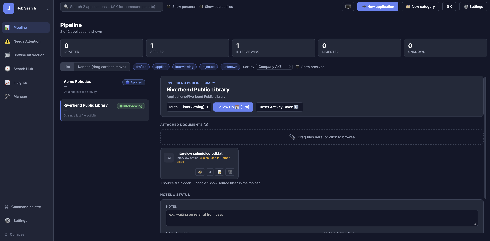

<p style="text-align:center;">
  
</p>

**JobTracker Hub (v1.0.0)** is a local, private dashboard over a folder of job-application documents already sitting on disk. Instead of asking users to migrate resumes, cover letters, and correspondence into a SaaS tracker, it reads whatever folder structure they already use for a job search and turns it into an interactive pipeline — list and Kanban views, follow-up triage, full-text search, and analytics — as a single process running on `localhost`.

- <a href="https://github.com/willmaddock/jobtracker-hub" target="_blank" rel="noopener noreferrer"><strong>View the GitHub repository</strong></a>
- <a href="https://github.com/willmaddock/jobtracker-hub/blob/main/docs/JobTracker_User_Guide.pdf" target="_blank" rel="noopener noreferrer"><strong>View the user guide</strong></a>

> JobTracker Hub is local software by design — there is no hosted demo. It runs as a Python process on the machine that's running it, and the API binds to `127.0.0.1` only.

---

## Project Highlights

- Designed a **local-first architecture**: FastAPI server bound to `localhost`, SQLite storage, and a filesystem-backed document model — no account, no cloud service, no external upload of application documents.
- Built a **React frontend** (loaded from a CDN, no build step) served as a single static HTML file directly by the FastAPI backend, so the whole application runs as one process.
- Implemented **list and drag-and-drop Kanban pipeline views**, with cards reflecting live status and days-since-activity.
- Built a **Needs Attention** triage view driven by configurable staleness and next-action rules, with follow-up, snooze, archive, and bulk actions — nothing is permanently deleted through normal workflows.
- Added **full-text search** across indexed filenames, companies, and roles, with inline result highlighting, plus a `⌘K`/`Ctrl+K` command palette and `j`/`k`/arrow-key list navigation.
- Implemented **document management** (upload, rename, delete-to-Trash) and an inline PDF viewer.
- Built an **Insights** view (response rate, interview rate, time-to-response, application velocity) rendered with Chart.js.
- Designed a **two-database architecture** that separates the disposable, auto-rebuilt filesystem index from durable user-entered data, so rebuilding the index never destroys notes, statuses, or dates.
- Added a **configuration-driven classification system** (`classify_config.json`, `classify.py`) so the folder-to-section mapping and document-type detection can be adapted to a user's own folder structure.
- Supported **multiple independent trackers** through a tracker switcher, and a zero-config installation model where the app determines its tracker root from its own filesystem position.

---

## My Role: Designer and Developer

I designed and built the application independently, including:

- Backend API design and implementation in FastAPI
- The filesystem indexer and classification/configuration system
- The two-database data model separating generated index data from user overrides
- The full React frontend, including the Kanban board, command palette, and keyboard navigation
- Search, document management, and the inline PDF viewer
- Insights metrics and Chart.js visualizations
- Multi-tracker/workspace support
- Project documentation, including the user guide

---

## Core Capabilities

1. **Pipeline** — list and drag-and-drop Kanban views of every application, grouped by status.
2. **Needs Attention** — rule-based triage for stale applications and due next actions, with follow-up, snooze, archive, and bulk operations.
3. **Search** — full-text search across filenames, companies, and roles, with highlighted matches.
4. **Document Management** — drag-and-drop upload, in-place rename, and delete-to-Trash, with an inline PDF viewer.
5. **Insights** — response rate, interview rate, time-to-response, and velocity/status-distribution charts.
6. **Multiple Trackers** — a tracker switcher for managing more than one independent job search from the same running app.
7. **Command Palette and Keyboard Navigation** — `⌘K`/`Ctrl+K` fuzzy search and actions, plus `j`/`k`/arrow-key list navigation.
8. **Configuration-Driven Classification** — editable rules for mapping folder names to dashboard sections and detecting document types.

---

## Technology Stack

| Area | Technologies |
|---|---|
| Backend | Python, FastAPI, Uvicorn, Pydantic |
| Frontend | React (CDN, no build step), static HTML, Chart.js |
| Data | SQLite, filesystem-backed document index |
| Client persistence | `localStorage` (index cache), URL-driven view state |
| Interaction | Native HTML5 drag-and-drop, keyboard navigation |
| Packaging | Self-contained `_app/` directory, Python virtual environment |

---

## Architecture and Local Data Model

```text
Browser
   ↓
React frontend (served as static HTML, no build step)
   ↓
FastAPI server on 127.0.0.1
   ↓
SQLite + local filesystem
```

The application is deliberately built to run as one lightweight local process rather than a hosted stack. Two design decisions shape that architecture:

- **Two SQLite databases with different lifetimes.** `jobtracker.db` is a disposable, auto-rebuilt index of whatever is currently on disk. `overrides.db` holds the user's own data — status corrections, notes, dates, snoozes, and merges — keyed so that a full index rebuild never overwrites it.
- **Zero-config tracker detection.** The `_app/` directory is meant to sit one level inside the folder being tracked. The application resolves its tracker root from its own filesystem position rather than requiring a configured path, so there's nothing to type in or paste on first run.

This is local-first, privacy-conscious software rather than a security product: keeping documents on the user's own machine and binding the server to `localhost` avoids uploading sensitive job-search material to a third party, but it does not by itself guarantee the machine is otherwise secure.

---

## Repository Structure

| Resource | Purpose |
|---|---|
| <a href="https://github.com/willmaddock/jobtracker-hub/tree/main/_app" target="_blank" rel="noopener noreferrer">`_app/`</a> | Backend (`api.py`, `db.py`, `build_index.py`, `classify.py`) and frontend (`frontend/index.html`) |
| <a href="https://github.com/willmaddock/jobtracker-hub/blob/main/_app/classify_config.json" target="_blank" rel="noopener noreferrer">`_app/classify_config.json`</a> | User-editable section-mapping and classification rules |
| <a href="https://github.com/willmaddock/jobtracker-hub/tree/main/sample-tracker" target="_blank" rel="noopener noreferrer">`sample-tracker/`</a> | Sample job-search folder for trying the app before pointing it at real documents |
| <a href="https://github.com/willmaddock/jobtracker-hub/tree/main/docs" target="_blank" rel="noopener noreferrer">`docs/`</a> | User guide (PDF) and LaTeX source |
| <a href="https://github.com/willmaddock/jobtracker-hub/blob/main/README.md" target="_blank" rel="noopener noreferrer">`README.md`</a> | Project README |

---

## Local Development

```bash
git clone https://github.com/willmaddock/jobtracker-hub.git
cd jobtracker-hub
cp -r sample-tracker my-tracker
cp -r _app my-tracker/_app
cd my-tracker/_app
python3 -m venv .venv
source .venv/bin/activate        # Windows: .venv\Scripts\activate
pip install -r requirements.txt
uvicorn api:app --reload --port 8000
```

Open `http://127.0.0.1:8000` and click **Build index** to see the bundled sample data, then point `_app/` at a real job-search folder once you're comfortable with the app.

---

## Engineering Value

This project demonstrates:

- Full-stack application design across a Python/FastAPI backend and a React frontend
- API design and local data modeling with SQLite
- Filesystem-integrated software that indexes and classifies existing user data
- Privacy-conscious, local-first architecture as a deliberate design constraint
- Complex browser interaction: drag-and-drop, command palette, keyboard navigation
- Document management and inline preview
- Analytics and data visualization
- Configuration-driven behavior for adapting to different users' folder structures
- End-to-end product ownership, from architecture through documentation
