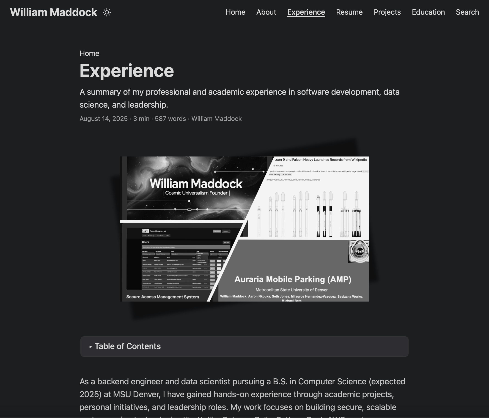

  

Launched on **August 14, 2025**, this isn't just any project—it's the one you're reading right now! As a backend engineer with a flair for full-stack fun, I created this Hugo-based portfolio to showcase my skills, projects, and certifications in a clean, responsive way. Using the PaperMod theme, it's deployed on GitHub Pages with GitHub Actions for seamless updates. Think of it as a meta masterpiece: a site that documents my work while demonstrating web dev prowess.

👉 <a href="https://willmaddock.github.io/dev/" target="_blank" rel="noopener noreferrer"><strong>Explore the Live Site (You're Already Here!)</strong></a>  
👉 <a href="https://github.com/willmaddock/dev" target="_blank" rel="noopener noreferrer"><strong>View the GitHub Repository</strong></a>

---

### 🔍 Project Highlights

- Crafted a personal portfolio using **Hugo** static site generator and **PaperMod** theme for speed and elegance.
- Integrated custom menu, search functionality, and responsive design to highlight education, experience, resume, and projects—like this one!
- Deployed via **GitHub Pages** with automated builds using GitHub Actions, ensuring every push goes live effortlessly.
- Added fun elements: Meta self-reference, searchable content, and embedded PDFs/images for a dynamic feel.
- Promoted open-source vibes with easy-to-fork code, perfect for fellow devs to adapt.

---

### 📦 My Role: Creator, Designer, and Chief Fun Officer

- **Vision and Leadership**: Dreamed up a site that's professional yet playful, blending tech showcase with a touch of humor (e.g., documenting the site within itself!).
- **Development**: Configured Hugo from scratch, integrated PaperMod theme, and customized layouts for sections like Projects and Education.
- **Deployment**: Set up GitHub Actions workflow for CI/CD, handling submodules (like PaperMod) and static generation.
- **Content Creation**: Wrote Markdown for all pages, embedded images/PDFs, and optimized for SEO and search.
- **Fun Factor**: Added Easter eggs like this meta project page—because why not make portfolios entertaining?

This project leveled up my skills in **static site generation**, **CI/CD pipelines**, and **creative web design**.

---

### 👥 Contributors and Credits

A solo adventure with props to the open-source community: Hugo team, PaperMod creator (adityatelange), and GitHub for hosting. Licensed under MIT (or your preferred license—feel free to fork and remix!).

Shoutout to Grok for brainstorming sessions—AI-assisted creativity at its finest!

---

### ✨ Key Features

This portfolio isn't just static—it's a living, breathing (well, digitally) showcase with bells and whistles:

1. **Responsive Design**: Looks great on mobile, desktop, or even your smart fridge, thanks to PaperMod's fluent theme.
2. **Search Functionality**: Powered by Fuse.js—find anything from "Rust" to "SpaceX" in seconds.
3. **Custom Menu Navigation**: Easy jumps to About, Experience, Resume, Projects, Education, and Search.
4. **Embedded Media**: PDFs (like resumes and reports), images, and links to external tools/repos.
5. **Meta Fun**: This page references the site itself—recursion level: expert!
6. **Automated Deployment**: GitHub Actions builds and deploys on every commit—no manual uploads needed.

**Integrations**: Hugo, GitHub Pages/Actions, PaperMod theme, Fuse.js for search.

---

### 🛠️ Technologies Used

- **Languages/Tools**: Hugo (Go-based SSG), Markdown, TOML for config.
- **Themes/Frameworks**: PaperMod (responsive Hugo theme).
- **Deployment**: GitHub Pages, GitHub Actions (YAML workflows).
- **Methodologies**: Static site generation, Git version control, open-source best practices.
- **Documentation**: Inline in hugo.toml and content files; see README for setup.

---

### 📁 Repository Contents

| Resource | Description |
|----------|-------------|
| <a href="https://github.com/willmaddock/dev/blob/main/README.md" target="_blank" rel="noopener noreferrer">README.md</a> | Project overview, setup, and fun facts |
| <a href="https://github.com/willmaddock/dev/blob/main/hugo.toml" target="_blank" rel="noopener noreferrer">hugo.toml</a> | Site configuration (menu, theme, search opts) |
| <a href="https://github.com/willmaddock/dev/tree/main/content" target="_blank" rel="noopener noreferrer">content/</a> | All pages: about.md, experience.md, projects/, etc. |
| <a href="https://github.com/willmaddock/dev/tree/main/static" target="_blank" rel="noopener noreferrer">static/</a> | Images, PDFs, resumes—your media hub |
| <a href="https://github.com/willmaddock/dev/tree/main/themes/PaperMod" target="_blank" rel="noopener noreferrer">themes/PaperMod/</a> | The magic theme submodule |
| <a href="https://github.com/willmaddock/dev/tree/main/.github/workflows" target="_blank" rel="noopener noreferrer">.github/workflows/</a> | GitHub Actions for deployment |
| <a href="https://github.com/willmaddock/dev/blob/main/.gitignore" target="_blank" rel="noopener noreferrer">.gitignore</a> | Keeps things clean (ignores public/, etc.) |

---

### 📈 Project Rigor

The <a href="https://github.com/willmaddock/dev" target="_blank" rel="noopener noreferrer">GitHub repository</a> is a testament to clean code and automation:
- Commit history from initial setup to v02 tag (August 14, 2025).
- Comprehensive structure with content separation for easy updates.
- Open-source ready: Clone, hugo server, and you're live locally.

**Setup**:
1. Clone: `git clone https://github.com/willmaddock/dev.git`
2. Install Hugo: `brew install hugo` (on macOS).
3. Run: `hugo server` and visit localhost:1313/dev/.
4. Deploy: Push to main—Actions handles the rest!

---

### 🎓 Relevant Credentials (Tied to Web Dev)

While this is more web-focused, it builds on my AWS skills for potential cloud-hosted expansions:

| Badge | Description | Credential Link |
|-------|-------------|------------------|
| <a href="https://www.credly.com/badges/c430067b-6fbf-4186-883b-7db12ef41220/linked_in_profile" target="_blank" rel="noopener noreferrer">Web Builder</a> | Building web apps on AWS | <a href="https://www.credly.com/badges/c430067b-6fbf-4186-883b-7db12ef41220/linked_in_profile" target="_blank" rel="noopener noreferrer">View</a> |
| <a href="https://www.credly.com/badges/807d3569-f378-4a96-9b6f-1dc6c6000abd/linked_in_profile" target="_blank" rel="noopener noreferrer">Networking</a> | Cloud networking for sites | <a href="https://www.credly.com/badges/807d3569-f378-4a96-9b6f-1dc6c6000abd/linked_in_profile" target="_blank" rel="noopener noreferrer">View</a> |
| <a href="https://www.credly.com/badges/db5b1006-562b-4ede-9d69-931ffed7631d/linked_in_profile" target="_blank" rel="noopener noreferrer">Serverless</a> | Serverless hosting ideas | <a href="https://www.credly.com/badges/db5b1006-562b-4ede-9d69-931ffed7631d/linked_in_profile" target="_blank" rel="noopener noreferrer">View</a> |

---

### 🔗 Links and Resources

- <a href="https://willmaddock.github.io/dev/" target="_blank" rel="noopener noreferrer">Live Portfolio Site</a>
- <a href="https://github.com/willmaddock/dev" target="_blank" rel="noopener noreferrer">GitHub Repository</a>
- <a href="https://github.com/willmaddock/dev/blob/main/README.md" target="_blank" rel="noopener noreferrer">Project README</a>
- <a href="https://github.com/adityatelange/hugo-PaperMod" target="_blank" rel="noopener noreferrer">PaperMod Theme Repo</a>
- <a href="https://gohugo.io/" target="_blank" rel="noopener noreferrer">Hugo Documentation</a>

Dive in and explore—after all, you're already here! If this made you smile, mission accomplished. 🚀