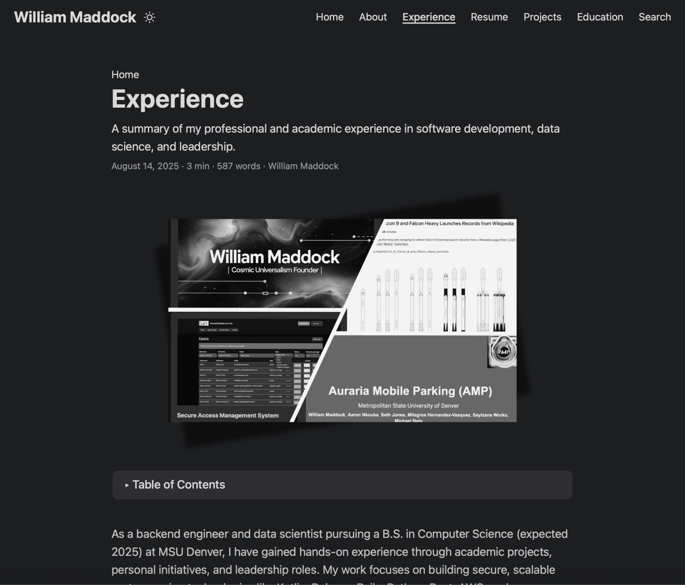

<p style="text-align:center;">
  
</p>

Launched in **August 2025** and maintained as an active project, this portfolio presents my software engineering experience, projects, education, credentials, and downloadable résumé through a fast static website.

- <a href="https://willmaddock.github.io/dev/" target="_blank" rel="noopener noreferrer"><strong>Open the live portfolio</strong></a>
- <a href="https://github.com/willmaddock/dev" target="_blank" rel="noopener noreferrer"><strong>View the GitHub repository</strong></a>

---

## Project Highlights

- Built the site with **Hugo** and the **PaperMod** theme.
- Organized content as maintainable Markdown pages with structured front matter.
- Added project, experience, education, résumé, about, and search sections.
- Integrated responsive images, embedded PDFs, downloadable files, and external project links.
- Enabled full-site search through Hugo JSON output and Fuse.js.
- Automated static builds and GitHub Pages deployment through GitHub Actions.
- Maintained canonical URLs, searchable summaries, metadata, and mobile-responsive navigation.
- Updated the portfolio to reflect current CUCII work, software-engineering positioning, and job-targeted résumé materials.

---

## My Role

As the sole developer and content owner, I manage:

- Site architecture and navigation
- Hugo and PaperMod configuration
- Markdown content and front matter
- Responsive presentation and embedded media
- Search configuration
- Git and GitHub workflows
- Deployment and troubleshooting
- Project documentation and résumé distribution
- Ongoing accuracy and consistency reviews

---

## Technology Stack

| Area | Technologies |
|---|---|
| Static site generator | Hugo |
| Theme | PaperMod |
| Content | Markdown, HTML, TOML |
| Search | Hugo JSON output, Fuse.js |
| Version control | Git, GitHub |
| CI/CD and hosting | GitHub Actions, GitHub Pages |
| Media | Responsive images, embedded and downloadable PDFs |

---

## Repository Structure

| Resource | Purpose |
|---|---|
| <a href="https://github.com/willmaddock/dev/tree/main/content" target="_blank" rel="noopener noreferrer">`content/`</a> | Page and project Markdown |
| <a href="https://github.com/willmaddock/dev/tree/main/static" target="_blank" rel="noopener noreferrer">`static/`</a> | Images, PDFs, and other public assets |
| <a href="https://github.com/willmaddock/dev/blob/main/hugo.toml" target="_blank" rel="noopener noreferrer">`hugo.toml`</a> | Site, menu, profile, search, and rendering configuration |
| <a href="https://github.com/willmaddock/dev/tree/main/.github/workflows" target="_blank" rel="noopener noreferrer">`.github/workflows/`</a> | Automated build and deployment |
| <a href="https://github.com/willmaddock/dev/tree/main/themes/PaperMod" target="_blank" rel="noopener noreferrer">`themes/PaperMod/`</a> | Theme source or submodule |

---

## Local Development

```bash
git clone https://github.com/willmaddock/dev.git
cd dev
hugo server
```

With the configured `/dev/` base path, the local site is available at:

```text
http://localhost:1313/dev/
```

---

## Engineering Value

This project demonstrates:

- Static-site architecture
- CI/CD and deployment automation
- Search and content organization
- Responsive web presentation
- Technical writing and documentation
- Public project communication
- Ongoing maintenance of a production portfolio
