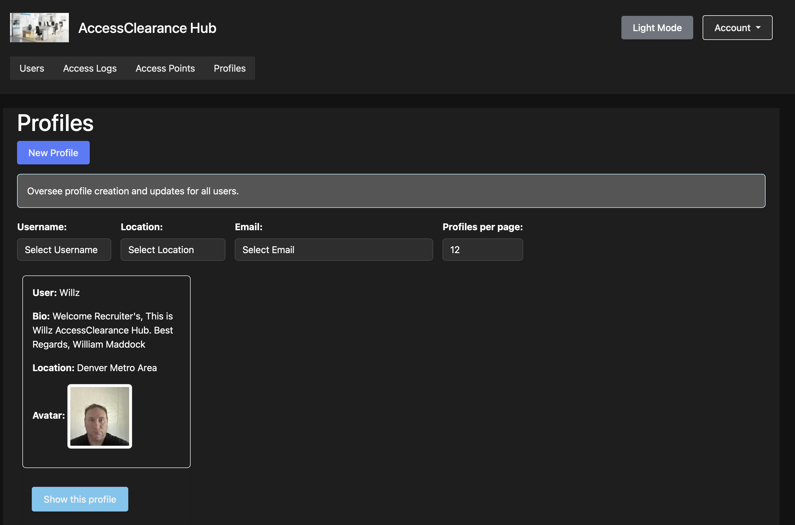

<p style="text-align:center;">
  
</p>

From **September through December 2024**, I designed and developed the **Secure Access Management System** as a full-stack Ruby on Rails project at MSU Denver.

The application demonstrates backend development, relational data, authentication and authorization concepts, role-based access control, validation, cloud-backed file management, automated testing, and accessibility-focused interface design.

- <a href="https://final-project-jk9d.onrender.com" target="_blank" rel="noopener noreferrer"><strong>Open the deployed application</strong></a>
- <a href="https://github.com/willmaddock/final-project/tree/SprintDeployment" target="_blank" rel="noopener noreferrer"><strong>View the GitHub repository</strong></a>
- <a href="https://www.youtube.com/watch?v=8h-CNthscBM" target="_blank" rel="noopener noreferrer"><strong>Watch the project presentation</strong></a>

> The deployed educational demo may sleep or change over time. Test accounts and passwords are maintained in project documentation rather than published on this portfolio page.

---

## Project Highlights

- Built a full-stack **Ruby on Rails** application across four development sprints.
- Implemented role-based permissions for administrative and operational user types.
- Created protected-resource and security-clearance workflows.
- Added validation and permission-aware navigation.
- Integrated **Google Cloud Storage** through Active Storage for persistent uploads.
- Used **PostgreSQL** for relational persistence.
- Added responsive Bootstrap interfaces, keyboard navigation, semantic labels, and accessible feedback.
- Wrote automated tests with **RSpec** and **Capybara**.
- Configured the application for deployment through Render and Puma.

---

## My Role: Founder and Lead Developer

I owned the project lifecycle:

- Defined scope and application requirements
- Designed the data model and permission structure
- Implemented models, controllers, views, validations, and navigation
- Integrated cloud-backed file storage
- Developed automated tests
- Prepared documentation and seeded demonstration data
- Configured and troubleshot deployment
- Presented the completed project

---

## Core Capabilities

1. **Role-Based Access Control** — different permissions and interfaces by user role.
2. **Protected Resources** — restricted access based on role and clearance rules.
3. **File Management** — persistent uploads through Google Cloud Storage.
4. **Validation and Feedback** — application-level constraints and user-facing status messages.
5. **Accessible Interface** — responsive layout, keyboard support, semantic structure, and readable feedback.
6. **Automated Testing** — model and system tests through RSpec and Capybara.
7. **Deployable Architecture** — Rails, PostgreSQL, Puma, Render, and Active Storage.

---

## Technology Stack

| Area | Technologies |
|---|---|
| Application | Ruby on Rails, Ruby |
| Frontend | ERB, HTML, CSS, JavaScript, Bootstrap |
| Database | PostgreSQL |
| Authorization | Role-based access control and clearance rules |
| Storage | Google Cloud Storage, Active Storage |
| Testing | RSpec, Capybara |
| Deployment | Render, Puma |
| Workflow | Git, four-sprint development process |

---

## Repository Resources

- <a href="https://github.com/willmaddock/final-project/tree/SprintDeployment/app/models" target="_blank" rel="noopener noreferrer">Models and validations</a>
- <a href="https://github.com/willmaddock/final-project/tree/SprintDeployment/app/controllers" target="_blank" rel="noopener noreferrer">Controllers and request handling</a>
- <a href="https://github.com/willmaddock/final-project/tree/SprintDeployment/app/views" target="_blank" rel="noopener noreferrer">Views and responsive interfaces</a>
- <a href="https://github.com/willmaddock/final-project/tree/SprintDeployment/db/migrate" target="_blank" rel="noopener noreferrer">Database migrations</a>
- <a href="https://github.com/willmaddock/final-project/tree/SprintDeployment/spec" target="_blank" rel="noopener noreferrer">RSpec and Capybara tests</a>
- <a href="https://github.com/willmaddock/final-project/blob/SprintDeployment/README.md" target="_blank" rel="noopener noreferrer">Project README</a>

---

## Local Setup

```bash
git clone https://github.com/willmaddock/final-project.git
cd final-project
git checkout SprintDeployment
bundle install
bundle exec rails db:create db:migrate db:seed
bundle exec rails server
```
