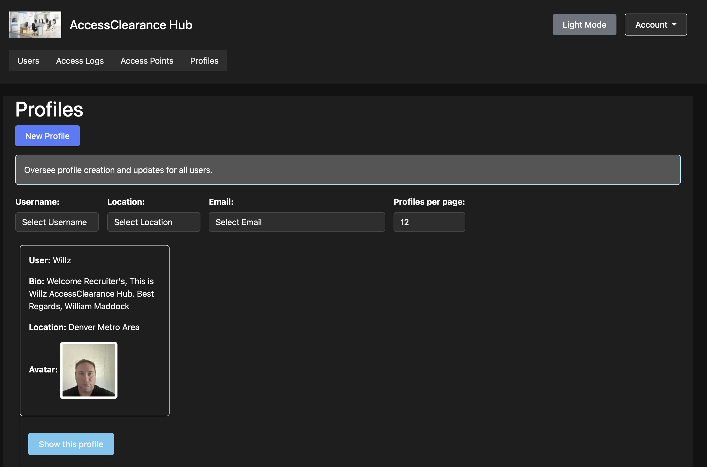

  

From **September 2024 to December 2024**, I founded and led the **Secure Access Management System** as part of my B.S. in Computer Science (expected 2025) at MSU Denver. This Ruby on Rails web application implements **role-based access control (RBAC)**, **security clearance management**, and **accessibility-first design** for secure, user-friendly workflows.

👉 <a href="https://final-project-jk9d.onrender.com" target="_blank" rel="noopener noreferrer"><strong>View Live Application Website</strong></a>  
👉 <a href="https://github.com/willmaddock/final-project/tree/SprintDeployment" target="_blank" rel="noopener noreferrer"><strong>View GitHub Repository</strong></a>  
▶️ <a href="https://www.youtube.com/watch?v=8h-CNthscBM" target="_blank" rel="noopener noreferrer"><strong>Project Presentation Video</strong></a>

---

🔑 **Default Login Credentials**  
Use this seeded account to access the app for testing purposes only:
- **Email**: logistics_manager@example.com
- **Password**: password

**Note**: These credentials are for demonstration and evaluation purposes. Please do not use them for any real-world operations or share them beyond authorized testing. For security, I recommend creating your own account for extended use.

---

### 🔍 Project Highlights

- Built a **Ruby on Rails** web app with dynamic **RBAC** for Admin, Shipping Agent, and Logistics Manager roles across four development sprints.
- Integrated **Google Cloud Storage** for persistent file uploads.
- Implemented **accessibility-first** design with ARIA roles, high contrast, and keyboard navigation.
- Deployed on **Render** with zero downtime on a 256 MB free tier.

---

### 📦 My Role: Founder and Lead Developer

- **Vision and Leadership**: Defined the project’s scope for secure, accessible access management.
- **Development**: Designed and coded the app, including RBAC, UI, and cloud storage integration.
- **Testing**: Wrote RSpec and Capybara tests, achieving 97% model coverage.
- **Deployment**: Configured Puma and Render for low-RAM production deployment.

This role enhanced my skills in **web development**, **security**, and **accessibility**.

---

### 👥 Contributors and Credits

A solo-led project developed for educational purposes, with potential for future open-source contributions. Licensed under the <a href="https://creativecommons.org/licenses/by-nc-sa/4.0/" target="_blank" rel="noopener noreferrer">Creative Commons Attribution-NonCommercial-ShareAlike 4.0</a>.

---

### ✨ Key Features

The Secure Access Management System offers:

1. **Dynamic RBAC**: Role-based access for Admin, Shipping Agent, and Logistics Manager.
2. **Real-Time Feedback**: Alerts for unauthorized access attempts.
3. **Persistent Uploads**: File storage via Google Cloud Storage.
4. **Responsive UI**: Bootstrap with Dark Mode toggle.
5. **Upload Validation**: Prevents memory overload.
6. **Seed System**: Instant demo data setup.
7. **Accessibility-First**: ARIA roles, high contrast, keyboard navigation.

**Integrations**: Google Cloud Storage, PostgreSQL, Bootstrap, Render.

---

### 🛠️ Technologies Used

- **Languages/Frameworks**: Ruby on Rails, HTML5, CSS3, JavaScript, Bootstrap
- **Database**: PostgreSQL
- **Storage**: Google Cloud Storage (Active Storage)
- **Testing**: RSpec, Capybara
- **Deployment**: Render, Puma
- **Methodologies**: Agile, DevOps
- **Documentation**: <a href="https://github.com/willmaddock/final-project/blob/SprintDeployment/README.md" target="_blank" rel="noopener noreferrer">README</a>, <a href="https://guides.rubyonrails.org" target="_blank" rel="noopener noreferrer">Technical Documentation</a>

---

### 📁 Repository Contents

| Resource | Description |
|----------|-------------|
| <a href="https://github.com/willmaddock/final-project/tree/SprintDeployment/app/models" target="_blank" rel="noopener noreferrer">app/models</a> | ActiveRecord models and validations |
| <a href="https://github.com/willmaddock/final-project/tree/SprintDeployment/app/controllers" target="_blank" rel="noopener noreferrer">app/controllers</a> | Controller logic and seed trigger |
| <a href="https://github.com/willmaddock/final-project/tree/SprintDeployment/app/views" target="_blank" rel="noopener noreferrer">app/views</a> | Responsive ERB templates |
| <a href="https://github.com/willmaddock/final-project/tree/SprintDeployment/db/migrate" target="_blank" rel="noopener noreferrer">db/migrate</a> | Database schema migrations |
| <a href="https://github.com/willmaddock/final-project/blob/SprintDeployment/db/seeds.rb" target="_blank" rel="noopener noreferrer">db/seeds.rb</a> | Demo dataset creation |
| <a href="https://github.com/willmaddock/final-project/tree/SprintDeployment/spec" target="_blank" rel="noopener noreferrer">spec/</a> | RSpec unit and system tests |
| <a href="https://github.com/willmaddock/final-project/blob/SprintDeployment/config/puma.rb" target="_blank" rel="noopener noreferrer">config/puma.rb</a> | Puma config for low-RAM environments |
| <a href="https://github.com/willmaddock/final-project/blob/SprintDeployment/config/storage.yml" target="_blank" rel="noopener noreferrer">config/storage.yml</a> | Google Cloud Storage configuration |

---

### 📈 Project Rigor

The <a href="https://github.com/willmaddock/final-project/tree/SprintDeployment" target="_blank" rel="noopener noreferrer">GitHub repository</a> showcases:
- Detailed commit history across four development sprints (September 2024 – December 2024).
- Comprehensive test coverage (97% model coverage) with RSpec and Capybara.
- Production-ready deployment on Render with optimized Puma settings.

**Setup**:
1. Clone: `git clone https://github.com/willmaddock/final-project.git`
2. Install dependencies: `bundle install`
3. Setup database: `bundle exec rails db:drop db:create db:migrate db:seed`
4. Start server: `rails server`
5. See <a href="https://github.com/willmaddock/final-project/blob/SprintDeployment/README.md" target="_blank" rel="noopener noreferrer">README</a> for details.

**System Architecture**:
<svg aria-roledescription="flowchart-v2" role="graphics-document document" viewBox="0 0 751.34375 582" style="max-width: 751.34375px;" class="flowchart" xmlns:xlink="http://www.w3.org/1999/xlink" xmlns="http://www.w3.org/2000/svg" width="100%" id="mermaid-diagram-mermaid-ik6hf5q"><g><marker orient="auto" markerHeight="8" markerWidth="8" markerUnits="userSpaceOnUse" refY="5" refX="5" viewBox="0 0 10 10" class="marker flowchart-v2" id="mermaid-diagram-mermaid-ik6hf5q_flowchart-v2-pointEnd"><path style="stroke-width: 1; stroke-dasharray: 1, 0;" class="arrowMarkerPath" d="M 0 0 L 10 5 L 0 10 z"></path></marker><marker orient="auto" markerHeight="8" markerWidth="8" markerUnits="userSpaceOnUse" refY="5" refX="4.5" viewBox="0 0 10 10" class="marker flowchart-v2" id="mermaid-diagram-mermaid-ik6hf5q_flowchart-v2-pointStart"><path style="stroke-width: 1; stroke-dasharray: 1, 0;" class="arrowMarkerPath" d="M 0 5 L 10 10 L 10 0 z"></path></marker><marker orient="auto" markerHeight="11" markerWidth="11" markerUnits="userSpaceOnUse" refY="5" refX="11" viewBox="0 0 10 10" class="marker flowchart-v2" id="mermaid-diagram-mermaid-ik6hf5q_flowchart-v2-circleEnd"><circle style="stroke-width: 1; stroke-dasharray: 1, 0;" class="arrowMarkerPath" r="5" cy="5" cx="5"></circle></marker><marker orient="auto" markerHeight="11" markerWidth="11" markerUnits="userSpaceOnUse" refY="5" refX="-1" viewBox="0 0 10 10" class="marker flowchart-v2" id="mermaid-diagram-mermaid-ik6hf5q_flowchart-v2-circleStart"><circle style="stroke-width: 1; stroke-dasharray: 1, 0;" class="arrowMarkerPath" r="5" cy="5" cx="5"></circle></marker><marker orient="auto" markerHeight="11" markerWidth="11" markerUnits="userSpaceOnUse" refY="5.2" refX="12" viewBox="0 0 11 11" class="marker cross flowchart-v2" id="mermaid-diagram-mermaid-ik6hf5q_flowchart-v2-crossEnd"><path style="stroke-width: 2; stroke-dasharray: 1, 0;" class="arrowMarkerPath" d="M 1,1 l 9,9 M 10,1 l -9,9"></path></marker><marker orient="auto" markerHeight="11" markerWidth="11" markerUnits="userSpaceOnUse" refY="5.2" refX="-1" viewBox="0 0 11 11" class="marker cross flowchart-v2" id="mermaid-diagram-mermaid-ik6hf5q_flowchart-v2-crossStart"><path style="stroke-width: 2; stroke-dasharray: 1, 0;" class="arrowMarkerPath" d="M 1,1 l 9,9 M 10,1 l -9,9"></path></marker><g class="root"><g class="clusters"></g><g class="edgePaths"><path marker-end="url(#mermaid-diagram-mermaid-ik6hf5q_flowchart-v2-pointEnd)" style="" class="edge-thickness-normal edge-pattern-solid edge-thickness-normal edge-pattern-solid flowchart-link" id="L_A_B_0" d="M375.828,62L375.828,68.167C375.828,74.333,375.828,86.667,375.828,98.333C375.828,110,375.828,121,375.828,126.5L375.828,132"></path><path marker-end="url(#mermaid-diagram-mermaid-ik6hf5q_flowchart-v2-pointEnd)" style="" class="edge-thickness-normal edge-pattern-solid edge-thickness-normal edge-pattern-solid flowchart-link" id="L_B_C_0" d="M303.406,181.758L274.294,189.298C245.182,196.839,186.958,211.919,157.846,224.96C128.734,238,128.734,249,128.734,254.5L128.734,260"></path><path marker-end="url(#mermaid-diagram-mermaid-ik6hf5q_flowchart-v2-pointEnd)" style="" class="edge-thickness-normal edge-pattern-solid edge-thickness-normal edge-pattern-solid flowchart-link" id="L_B_D_0" d="M375.828,190L375.828,196.167C375.828,202.333,375.828,214.667,375.828,226.333C375.828,238,375.828,249,375.828,254.5L375.828,260"></path><path marker-end="url(#mermaid-diagram-mermaid-ik6hf5q_flowchart-v2-pointEnd)" style="" class="edge-thickness-normal edge-pattern-solid edge-thickness-normal edge-pattern-solid flowchart-link" id="L_B_E_0" d="M448.25,181.708L477.473,189.256C506.695,196.805,565.141,211.903,594.363,224.951C623.586,238,623.586,249,623.586,254.5L623.586,260"></path><path marker-end="url(#mermaid-diagram-mermaid-ik6hf5q_flowchart-v2-pointEnd)" style="" class="edge-thickness-normal edge-pattern-solid edge-thickness-normal edge-pattern-solid flowchart-link" id="L_C_F_0" d="M128.734,318L128.734,324.167C128.734,330.333,128.734,342.667,128.734,354.333C128.734,366,128.734,377,128.734,382.5L128.734,388"></path><path marker-end="url(#mermaid-diagram-mermaid-ik6hf5q_flowchart-v2-pointEnd)" style="" class="edge-thickness-normal edge-pattern-solid edge-thickness-normal edge-pattern-solid flowchart-link" id="L_D_G_0" d="M375.828,318L375.828,324.167C375.828,330.333,375.828,342.667,375.828,354.333C375.828,366,375.828,377,375.828,382.5L375.828,388"></path><path marker-end="url(#mermaid-diagram-mermaid-ik6hf5q_flowchart-v2-pointEnd)" style="" class="edge-thickness-normal edge-pattern-solid edge-thickness-normal edge-pattern-solid flowchart-link" id="L_E_H_0" d="M623.586,318L623.586,324.167C623.586,330.333,623.586,342.667,623.586,354.333C623.586,366,623.586,377,623.586,382.5L623.586,388"></path><path marker-end="url(#mermaid-diagram-mermaid-ik6hf5q_flowchart-v2-pointEnd)" style="" class="edge-thickness-normal edge-pattern-solid edge-thickness-normal edge-pattern-solid flowchart-link" id="L_F_I_0" d="M128.734,446L128.734,452.167C128.734,458.333,128.734,470.667,128.734,482.333C128.734,494,128.734,505,128.734,510.5L128.734,516"></path><path marker-end="url(#mermaid-diagram-mermaid-ik6hf5q_flowchart-v2-pointEnd)" style="" class="edge-thickness-normal edge-pattern-solid edge-thickness-normal edge-pattern-solid flowchart-link" id="L_G_J_0" d="M375.828,446L375.828,452.167C375.828,458.333,375.828,470.667,375.828,482.333C375.828,494,375.828,505,375.828,510.5L375.828,516"></path><path marker-end="url(#mermaid-diagram-mermaid-ik6hf5q_flowchart-v2-pointEnd)" style="" class="edge-thickness-normal edge-pattern-solid edge-thickness-normal edge-pattern-solid flowchart-link" id="L_H_K_0" d="M623.586,446L623.586,452.167C623.586,458.333,623.586,470.667,623.586,482.333C623.586,494,623.586,505,623.586,510.5L623.586,516"></path></g><g class="edgeLabels"><g transform="translate(375.828125, 99)" class="edgeLabel"><g transform="translate(-48.59375, -12)" class="label"><foreignObject height="24" width="97.1875">

authenticates

</foreignObject></g></g><g transform="translate(128.734375, 227)" class="edgeLabel"><g transform="translate(-30.171875, -12)" class="label"><foreignObject height="24" width="60.34375">

accesses

</foreignObject></g></g><g transform="translate(375.828125, 227)" class="edgeLabel"><g transform="translate(-30.171875, -12)" class="label"><foreignObject height="24" width="60.34375">

accesses

</foreignObject></g></g><g transform="translate(623.5859375, 227)" class="edgeLabel"><g transform="translate(-30.171875, -12)" class="label"><foreignObject height="24" width="60.34375">

accesses

</foreignObject></g></g><g transform="translate(128.734375, 355)" class="edgeLabel"><g transform="translate(-30.6875, -12)" class="label"><foreignObject height="24" width="61.375">

manages

</foreignObject></g></g><g transform="translate(375.828125, 355)" class="edgeLabel"><g transform="translate(-13.7109375, -12)" class="label"><foreignObject height="24" width="27.421875">

logs

</foreignObject></g></g><g transform="translate(623.5859375, 355)" class="edgeLabel"><g transform="translate(-29.9140625, -12)" class="label"><foreignObject height="24" width="59.828125">

requests

</foreignObject></g></g><g transform="translate(128.734375, 483)" class="edgeLabel"><g transform="translate(-21.1171875, -12)" class="label"><foreignObject height="24" width="42.234375">

stores

</foreignObject></g></g><g transform="translate(375.828125, 483)" class="edgeLabel"><g transform="translate(-21.1171875, -12)" class="label"><foreignObject height="24" width="42.234375">

stores

</foreignObject></g></g><g transform="translate(623.5859375, 483)" class="edgeLabel"><g transform="translate(-19.421875, -12)" class="label"><foreignObject height="24" width="38.84375">

sends

</foreignObject></g></g></g><g class="nodes"><g transform="translate(375.828125, 35)" id="flowchart-A-0" class="node default"><rect height="54" width="91.40625" y="-27" x="-45.703125" style="" class="basic label-container"></rect><g transform="translate(-15.703125, -12)" style="" class="label"><rect></rect><foreignObject height="24" width="31.40625">

User

</foreignObject></g></g><g transform="translate(375.828125, 163)" id="flowchart-B-1" class="node default"><rect height="54" width="144.84375" y="-27" x="-72.421875" style="" class="basic label-container"></rect><g transform="translate(-42.421875, -12)" style="" class="label"><rect></rect><foreignObject height="24" width="84.84375">

Role System

</foreignObject></g></g><g transform="translate(128.734375, 291)" id="flowchart-C-3" class="node default"><rect height="54" width="182.75" y="-27" x="-91.375" style="" class="basic label-container"></rect><g transform="translate(-61.375, -12)" style="" class="label"><rect></rect><foreignObject height="24" width="122.75">

Admin Dashboard

</foreignObject></g></g><g transform="translate(375.828125, 291)" id="flowchart-D-5" class="node default"><rect height="54" width="211.4375" y="-27" x="-105.71875" style="" class="basic label-container"></rect><g transform="translate(-75.71875, -12)" style="" class="label"><rect></rect><foreignObject height="24" width="151.4375">

Shipping Agent Portal

</foreignObject></g></g><g transform="translate(623.5859375, 291)" id="flowchart-E-7" class="node default"><rect height="54" width="184.078125" y="-27" x="-92.0390625" style="" class="basic label-container"></rect><g transform="translate(-62.0390625, -12)" style="" class="label"><rect></rect><foreignObject height="24" width="124.078125">

Logistics Manager

</foreignObject></g></g><g transform="translate(128.734375, 419)" id="flowchart-F-9" class="node default"><rect height="54" width="241.46875" y="-27" x="-120.734375" style="" class="basic label-container"></rect><g transform="translate(-90.734375, -12)" style="" class="label"><rect></rect><foreignObject height="24" width="181.46875">

Access Point Management

</foreignObject></g></g><g transform="translate(375.828125, 419)" id="flowchart-G-11" class="node default"><rect height="54" width="141.890625" y="-27" x="-70.9453125" style="" class="basic label-container"></rect><g transform="translate(-40.9453125, -12)" style="" class="label"><rect></rect><foreignObject height="24" width="81.890625">

Access Logs

</foreignObject></g></g><g transform="translate(623.5859375, 419)" id="flowchart-H-13" class="node default"><rect height="54" width="239.515625" y="-27" x="-119.7578125" style="" class="basic label-container"></rect><g transform="translate(-89.7578125, -12)" style="" class="label"><rect></rect><foreignObject height="24" width="179.515625">

Elevated Access Requests

</foreignObject></g></g><g transform="translate(128.734375, 547)" id="flowchart-I-15" class="node default"><rect height="54" width="211.65625" y="-27" x="-105.828125" style="" class="basic label-container"></rect><g transform="translate(-75.828125, -12)" style="" class="label"><rect></rect><foreignObject height="24" width="151.65625">

Google Cloud Storage

</foreignObject></g></g><g transform="translate(375.828125, 547)" id="flowchart-J-17" class="node default"><rect height="54" width="138.171875" y="-27" x="-69.0859375" style="" class="basic label-container"></rect><g transform="translate(-39.0859375, -12)" style="" class="label"><rect></rect><foreignObject height="24" width="78.171875">

PostgreSQL

</foreignObject></g></g><g transform="translate(623.5859375, 547)" id="flowchart-K-19" class="node default"><rect height="54" width="193.6875" y="-27" x="-96.84375" style="" class="basic label-container"></rect><g transform="translate(-66.84375, -12)" style="" class="label"><rect></rect><foreignObject height="24" width="133.6875">

Email Notifications

</foreignObject></g></g></g></g></g></svg>

**Testing**:
- Unit tests: `bundle exec rspec spec/models/user_spec.rb`
- System tests: `bundle exec rspec spec/system/agent_login_spec.rb`, `bundle exec rspec spec/system/restricted_area_access_spec.rb`

---

### 🔗 Links and Resources

- <a href="https://final-project-jk9d.onrender.com" target="_blank" rel="noopener noreferrer">Live Application Website</a>
- <a href="https://github.com/willmaddock/final-project/tree/SprintDeployment" target="_blank" rel="noopener noreferrer">GitHub Repository</a>
- <a href="https://www.youtube.com/watch?v=8h-CNthscBM" target="_blank" rel="noopener noreferrer">Project Presentation Video</a>
- <a href="https://github.com/willmaddock/final-project/blob/SprintDeployment/README.md" target="_blank" rel="noopener noreferrer">Project README</a>
- <a href="../../Proposal.pdf" target="_blank" rel="noopener noreferrer">Project Proposal</a>
- <a href="../../Final Project Exploration Approval.pdf" target="_blank" rel="noopener noreferrer">Exploration Approval</a>
- <a href="../../Customer%20Requirements%20Report.pdf" target="_blank" rel="noopener noreferrer">Requirements Report</a>
- <a href="../../Wills Final Project Sprint 01.pdf" target="_blank" rel="noopener noreferrer">Sprint 01 Report</a>
- <a href="../../Final_Project_Sprint02_Presentation.pdf" target="_blank" rel="noopener noreferrer">Sprint 02 Presentation</a>
- <a href="../../Final_Project_Presentation.pdf" target="_blank" rel="noopener noreferrer">Final Presentation</a>
- <a href="https://developer.mozilla.org" target="_blank" rel="noopener noreferrer">MDN Web Docs</a>
- <a href="https://guides.rubyonrails.org" target="_blank" rel="noopener noreferrer">Ruby on Rails Guides</a>
- <a href="https://accessibility.blog.gov.uk" target="_blank" rel="noopener noreferrer">GOV.UK Accessibility Blog</a>
- <a href="https://render.com/docs" target="_blank" rel="noopener noreferrer">Render Deployment Docs</a>

*© 2024 William Maddock - All Rights Reserved*
