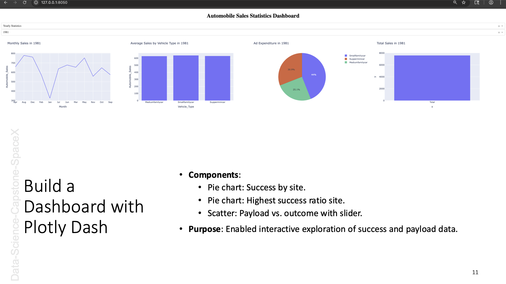

  

From **May 2025 to July 2025**, I completed a 5-week, 45-hour capstone project for the **IBM Data Science Professional Certificate** as part of my B.S. in Computer Science from MSU Denver. This project analyzed SpaceX launch outcomes, building a full data science pipeline to predict mission success using Python, machine learning, and interactive dashboards.

👉 <a href="https://www.coursera.org/account/accomplishments/specialization/68JLH79O3KTJ" target="_blank" rel="noopener noreferrer"><strong>View IBM Data Science Specialization Certificate</strong></a>  
👉 <a href="https://github.com/willmaddock/Data-Science-Capstone-SpaceX" target="_blank" rel="noopener noreferrer"><strong>View GitHub Repository</strong></a>

---

### 🔍 Project Highlights

- Designed a Python-based data science pipeline across five weeks, integrating SpaceX REST API and web scraping.
- Built interactive dashboards with Plotly Dash and Folium for launch site analysis.
- Achieved >90% accuracy in predicting launch outcomes using machine learning classifiers.
- Delivered a technical presentation summarizing methodology and insights.

---

### 📦 My Role: Data Scientist

- **Pipeline Development**: Built and executed a data science workflow, from data collection to model deployment.
- **Data Analysis**: Performed web scraping, data wrangling, and exploratory analysis with Pandas and SQL.
- **Visualization**: Created interactive dashboards using Plotly Dash and Folium maps.
- **Modeling**: Developed and tuned machine learning classifiers (Logistic Regression, Decision Trees).
- **Presentation**: Authored a technical report and presentation for Coursera evaluation.

This role strengthened my skills in **data science**, **machine learning**, and **data visualization**.

---

### 👥 Contributors and Credits

A solo-led academic project for the IBM Data Science Professional Certificate, completed for educational purposes.

---

### ✨ Key Features

The SpaceX Launch Analysis project offers:

1. **Data Collection**: Extracted launch data via SpaceX REST API and web scraping with BeautifulSoup.
2. **Data Wrangling**: Cleaned and preprocessed data using Pandas.
3. **Exploratory Analysis**: Generated scatter plots, bar charts, and SQL-based insights.
4. **Geolocation Visualization**: Mapped launch sites with Folium.
5. **Interactive Dashboards**: Built real-time filtering dashboards with Plotly Dash.
6. **Predictive Modeling**: Classified launch outcomes with >90% accuracy using scikit-learn.

**Integrations**: SpaceX REST API, Plotly Dash, Folium, Jupyter Notebooks.

---

### 🛠️ Technologies Used

- **Languages/Libraries**: Python, Pandas, scikit-learn, Plotly, BeautifulSoup, Folium
- **Tools**: Jupyter Notebooks, GitHub, SQL
- **Workflow**: Data wrangling, visualization, statistical modeling, dashboarding
- **Documentation**: <a href="https://github.com/willmaddock/Data-Science-Capstone-SpaceX/blob/main/README.markdown" target="_blank" rel="noopener noreferrer">README</a>, <a href="../../ds-capstone-template-coursera.pdf" target="_blank" rel="noopener noreferrer">Technical Presentation</a>

---

### 📁 Repository Contents

| Resource | Description |
|----------|-------------|
| <a href="https://github.com/willmaddock/Data-Science-Capstone-SpaceX/blob/main/jupyter-labs-spacex-data-collection-api.ipynb" target="_blank" rel="noopener noreferrer">SpaceX_API.ipynb</a> | Data collection via SpaceX REST API |
| <a href="https://github.com/willmaddock/Data-Science-Capstone-SpaceX/blob/main/jupyter-labs-webscraping.ipynb" target="_blank" rel="noopener noreferrer">Web_Scraping.ipynb</a> | HTML scraping for additional launch records |
| <a href="https://github.com/willmaddock/Data-Science-Capstone-SpaceX/blob/main/labs-jupyter-spacex-Data%20wrangling.ipynb" target="_blank" rel="noopener noreferrer">Data_Wrangling.ipynb</a> | Data cleaning and preprocessing |
| <a href="https://github.com/willmaddock/Data-Science-Capstone-SpaceX/blob/main/lab_jupyter_launch_site_location.ipynb" target="_blank" rel="noopener noreferrer">EDA_Visualization.ipynb</a> | Scatter plots, bar charts, and line graphs |
| <a href="https://github.com/willmaddock/Data-Science-Capstone-SpaceX/blob/main/jupyter-labs-eda-sql-coursera_sqllite.ipynb" target="_blank" rel="noopener noreferrer">EDA_SQL.ipynb</a> | SQL-based payload and booster insights |
| <a href="https://github.com/willmaddock/Data-Science-Capstone-SpaceX/blob/main/lab_jupyter_launch_site_location.ipynb" target="_blank" rel="noopener noreferrer">Folium_Map.ipynb</a> | Launch site geolocation and outcomes |
| <a href="https://github.com/willmaddock/Data-Science-Capstone-SpaceX/blob/main/ds-capstone-template-coursera.pdf" target="_blank" rel="noopener noreferrer">Plotly_Dash.ipynb</a> | Interactive dashboard with filters and metrics |
| <a href="https://github.com/willmaddock/Data-Science-Capstone-SpaceX/blob/main/edadataviz%20(1).ipynb" target="_blank" rel="noopener noreferrer">Predictive_Analysis.ipynb</a> | Classification model predictions |

---

### 📈 Project Rigor

The <a href="https://github.com/willmaddock/Data-Science-Capstone-SpaceX" target="_blank" rel="noopener noreferrer">GitHub repository</a> showcases:
- Structured commit history across five weeks (May–July 2025).
- Comprehensive Jupyter notebooks covering API integration, web scraping, analysis, visualization, and modeling.
- Locally deployed Plotly Dash dashboards for interactive exploration.

**Setup**:
1. Clone: `git clone https://github.com/willmaddock/Data-Science-Capstone-SpaceX.git`
2. Install dependencies: `pip install -r requirements.txt`
3. Run notebooks: Use Jupyter to execute `SpaceX_API.ipynb`, `Plotly_Dash.ipynb`, etc.
4. See <a href="https://github.com/willmaddock/Data-Science-Capstone-SpaceX/blob/main/README.markdown" target="_blank" rel="noopener noreferrer">README</a> for details.

**Data Science Pipeline**:
<svg aria-roledescription="flowchart-v2" role="graphics-document document" viewBox="0 0 1842.078125 198" style="max-width: 1842.078125px;" class="flowchart" xmlns:xlink="http://www.w3.org/1999/xlink" xmlns="http://www.w3.org/2000/svg" width="100%" id="mermaid-diagram-mermaid-f04ey7z"><g><marker orient="auto" markerHeight="8" markerWidth="8" markerUnits="userSpaceOnUse" refY="5" refX="5" viewBox="0 0 10 10" class="marker flowchart-v2" id="mermaid-diagram-mermaid-f04ey7z_flowchart-v2-pointEnd"><path style="stroke-width: 1; stroke-dasharray: 1, 0;" class="arrowMarkerPath" d="M 0 0 L 10 5 L 0 10 z"></path></marker><marker orient="auto" markerHeight="8" markerWidth="8" markerUnits="userSpaceOnUse" refY="5" refX="4.5" viewBox="0 0 10 10" class="marker flowchart-v2" id="mermaid-diagram-mermaid-f04ey7z_flowchart-v2-pointStart"><path style="stroke-width: 1; stroke-dasharray: 1, 0;" class="arrowMarkerPath" d="M 0 5 L 10 10 L 10 0 z"></path></marker><marker orient="auto" markerHeight="11" markerWidth="11" markerUnits="userSpaceOnUse" refY="5" refX="11" viewBox="0 0 10 10" class="marker flowchart-v2" id="mermaid-diagram-mermaid-f04ey7z_flowchart-v2-circleEnd"><circle style="stroke-width: 1; stroke-dasharray: 1, 0;" class="arrowMarkerPath" r="5" cy="5" cx="5"></circle></marker><marker orient="auto" markerHeight="11" markerWidth="11" markerUnits="userSpaceOnUse" refY="5" refX="-1" viewBox="0 0 10 10" class="marker flowchart-v2" id="mermaid-diagram-mermaid-f04ey7z_flowchart-v2-circleStart"><circle style="stroke-width: 1; stroke-dasharray: 1, 0;" class="arrowMarkerPath" r="5" cy="5" cx="5"></circle></marker><marker orient="auto" markerHeight="11" markerWidth="11" markerUnits="userSpaceOnUse" refY="5.2" refX="12" viewBox="0 0 11 11" class="marker cross flowchart-v2" id="mermaid-diagram-mermaid-f04ey7z_flowchart-v2-crossEnd"><path style="stroke-width: 2; stroke-dasharray: 1, 0;" class="arrowMarkerPath" d="M 1,1 l 9,9 M 10,1 l -9,9"></path></marker><marker orient="auto" markerHeight="11" markerWidth="11" markerUnits="userSpaceOnUse" refY="5.2" refX="-1" viewBox="0 0 11 11" class="marker cross flowchart-v2" id="mermaid-diagram-mermaid-f04ey7z_flowchart-v2-crossStart"><path style="stroke-width: 2; stroke-dasharray: 1, 0;" class="arrowMarkerPath" d="M 1,1 l 9,9 M 10,1 l -9,9"></path></marker><g class="root"><g class="clusters"></g><g class="edgePaths"><path marker-end="url(#mermaid-diagram-mermaid-f04ey7z_flowchart-v2-pointEnd)" style="" class="edge-thickness-normal edge-pattern-solid edge-thickness-normal edge-pattern-solid flowchart-link" id="L_A_B_0" d="M176.781,93L189.518,93C202.255,93,227.729,93,252.536,93C277.344,93,301.484,93,313.555,93L325.625,93"></path><path marker-end="url(#mermaid-diagram-mermaid-f04ey7z_flowchart-v2-pointEnd)" style="" class="edge-thickness-normal edge-pattern-solid edge-thickness-normal edge-pattern-solid flowchart-link" id="L_B_C_0" d="M496.297,93L515.281,93C534.266,93,572.234,93,609.536,93C646.839,93,683.474,93,701.792,93L720.109,93"></path><path marker-end="url(#mermaid-diagram-mermaid-f04ey7z_flowchart-v2-pointEnd)" style="" class="edge-thickness-normal edge-pattern-solid edge-thickness-normal edge-pattern-solid flowchart-link" id="L_C_D_0" d="M944.179,66L963.395,60.833C982.611,55.667,1021.044,45.333,1055.605,40.167C1090.167,35,1120.857,35,1136.202,35L1151.547,35"></path><path marker-end="url(#mermaid-diagram-mermaid-f04ey7z_flowchart-v2-pointEnd)" style="" class="edge-thickness-normal edge-pattern-solid edge-thickness-normal edge-pattern-solid flowchart-link" id="L_C_E_0" d="M944.179,120L963.395,125.167C982.611,130.333,1021.044,140.667,1057.548,145.833C1094.052,151,1128.628,151,1145.915,151L1163.203,151"></path><path marker-end="url(#mermaid-diagram-mermaid-f04ey7z_flowchart-v2-pointEnd)" style="" class="edge-thickness-normal edge-pattern-solid edge-thickness-normal edge-pattern-solid flowchart-link" id="L_D_F_0" d="M1377.406,35L1393.796,35C1410.185,35,1442.964,35,1480.12,35C1517.276,35,1558.81,35,1579.577,35L1600.344,35"></path><path marker-end="url(#mermaid-diagram-mermaid-f04ey7z_flowchart-v2-pointEnd)" style="" class="edge-thickness-normal edge-pattern-solid edge-thickness-normal edge-pattern-solid flowchart-link" id="L_E_G_0" d="M1365.75,151L1384.082,151C1402.414,151,1439.078,151,1473.133,151C1507.188,151,1538.633,151,1554.355,151L1570.078,151"></path></g><g class="edgeLabels"><g transform="translate(253.203125, 93)" class="edgeLabel"><g transform="translate(-51.421875, -12)" class="label"><foreignObject height="24" width="102.84375">

API &amp; Scraping

</foreignObject></g></g><g transform="translate(610.203125, 93)" class="edgeLabel"><g transform="translate(-88.90625, -12)" class="label"><foreignObject height="24" width="177.8125">

Cleaning &amp; Preprocessing

</foreignObject></g></g><g transform="translate(1059.4765625, 35)" class="edgeLabel"><g transform="translate(-67.9375, -12)" class="label"><foreignObject height="24" width="135.875">

SQL &amp; Visualization

</foreignObject></g></g><g transform="translate(1059.4765625, 151)" class="edgeLabel"><g transform="translate(-71.0703125, -12)" class="label"><foreignObject height="24" width="142.140625">

Feature Engineering

</foreignObject></g></g><g transform="translate(1475.7421875, 35)" class="edgeLabel"><g transform="translate(-73.3359375, -12)" class="label"><foreignObject height="24" width="146.671875">

Plotly Dash &amp; Folium

</foreignObject></g></g><g transform="translate(1475.7421875, 151)" class="edgeLabel"><g transform="translate(-39.71875, -12)" class="label"><foreignObject height="24" width="79.4375">

scikit-learn

</foreignObject></g></g></g><g class="nodes"><g transform="translate(92.390625, 93)" id="flowchart-A-0" class="node default"><rect height="54" width="168.78125" y="-27" x="-84.390625" style="" class="basic label-container"></rect><g transform="translate(-54.390625, -12)" style="" class="label"><rect></rect><foreignObject height="24" width="108.78125">

Data Collection

</foreignObject></g></g><g transform="translate(412.9609375, 93)" id="flowchart-B-1" class="node default"><rect height="54" width="166.671875" y="-27" x="-83.3359375" style="" class="basic label-container"></rect><g transform="translate(-53.3359375, -12)" style="" class="label"><rect></rect><foreignObject height="24" width="106.671875">

Data Wrangling

</foreignObject></g></g><g transform="translate(843.7578125, 93)" id="flowchart-C-3" class="node default"><rect height="54" width="239.296875" y="-27" x="-119.6484375" style="" class="basic label-container"></rect><g transform="translate(-89.6484375, -12)" style="" class="label"><rect></rect><foreignObject height="24" width="179.296875">

Exploratory Data Analysis

</foreignObject></g></g><g transform="translate(1266.4765625, 35)" id="flowchart-D-5" class="node default"><rect height="54" width="221.859375" y="-27" x="-110.9296875" style="" class="basic label-container"></rect><g transform="translate(-80.9296875, -12)" style="" class="label"><rect></rect><foreignObject height="24" width="161.859375">

Interactive Dashboards

</foreignObject></g></g><g transform="translate(1266.4765625, 151)" id="flowchart-E-7" class="node default"><rect height="54" width="198.546875" y="-27" x="-99.2734375" style="" class="basic label-container"></rect><g transform="translate(-69.2734375, -12)" style="" class="label"><rect></rect><foreignObject height="24" width="138.546875">

Predictive Modeling

</foreignObject></g></g><g transform="translate(1704.078125, 35)" id="flowchart-F-9" class="node default"><rect height="54" width="199.46875" y="-27" x="-99.734375" style="" class="basic label-container"></rect><g transform="translate(-69.734375, -12)" style="" class="label"><rect></rect><foreignObject height="24" width="139.46875">

Launch Site Insights

</foreignObject></g></g><g transform="translate(1704.078125, 151)" id="flowchart-G-11" class="node default"><rect height="78" width="260" y="-39" x="-130" style="" class="basic label-container"></rect><g transform="translate(-100, -24)" style="" class="label"><rect></rect><foreignObject height="48" width="200">

Launch Outcome Predictions

</foreignObject></g></g></g></g></g></svg>

---

### 🔗 Links and Resources

- <a href="https://www.coursera.org/account/accomplishments/specialization/68JLH79O3KTJ" target="_blank" rel="noopener noreferrer">IBM Data Science Specialization Certificate</a>
- <a href="https://github.com/willmaddock/Data-Science-Capstone-SpaceX" target="_blank" rel="noopener noreferrer">GitHub Repository</a>
- <a href="https://github.com/willmaddock/Data-Science-Capstone-SpaceX/blob/main/README.markdown" target="_blank" rel="noopener noreferrer">Project README</a>
- <a href="../../ds-capstone-template-coursera.pdf" target="_blank" rel="noopener noreferrer">Technical Presentation</a>
- <a href="https://developer.mozilla.org" target="_blank" rel="noopener noreferrer">MDN Web Docs</a>
- <a href="https://pandas.pydata.org/docs/" target="_blank" rel="noopener noreferrer">Pandas Documentation</a>
- <a href="https://scikit-learn.org/stable/" target="_blank" rel="noopener noreferrer">scikit-learn Documentation</a>
- <a href="https://plotly.com/python/" target="_blank" rel="noopener noreferrer">Plotly Python Documentation</a>

*© 2025 William Maddock - All Rights Reserved*