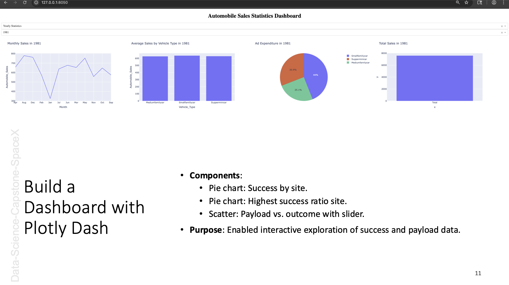

<p style="text-align:center;">
  
</p>

From **May through July 2025**, I completed an end-to-end SpaceX launch-analysis capstone for the **IBM Data Science Professional Certificate**.

The project covers the complete data workflow: collection, cleaning, exploratory analysis, SQL queries, geographic visualization, interactive dashboards, feature preparation, model training, evaluation, and technical presentation.

- <a href="https://www.coursera.org/account/accomplishments/specialization/68JLH79O3KTJ" target="_blank" rel="noopener noreferrer"><strong>View the IBM Data Science credential</strong></a>
- <a href="https://github.com/willmaddock/Data-Science-Capstone-SpaceX" target="_blank" rel="noopener noreferrer"><strong>View the GitHub repository</strong></a>
- <a href="../../ds-capstone-template-coursera.pdf" target="_blank" rel="noopener noreferrer"><strong>View the technical presentation</strong></a>

---

## Project Highlights

- Collected launch data from the **SpaceX REST API** and web-derived sources.
- Cleaned and transformed structured data with **Pandas**.
- Used SQL queries to examine payload, booster, site, and outcome relationships.
- Created charts and exploratory visualizations.
- Built launch-site maps with **Folium**.
- Developed an interactive **Plotly Dash** application.
- Trained and evaluated multiple classification models using consistent evaluation workflows.
- Documented methods, model comparisons, limitations, and conclusions.

The portfolio description intentionally avoids presenting a single accuracy percentage without the associated dataset split, metric, model, and evaluation context. Detailed results remain available in the notebooks and technical presentation.

---

## My Role: Data Scientist

I completed the project independently, including:

- API and web data collection
- Data wrangling and validation
- Exploratory data analysis
- SQL-based investigation
- Visualization and mapping
- Interactive dashboard development
- Feature preparation
- Classification-model training and comparison
- Technical reporting and presentation

---

## Data Pipeline

1. **Collect** — retrieve API and web-derived launch records.
2. **Clean** — normalize fields, address missing values, and create analysis-ready features.
3. **Explore** — use Python, SQL, charts, and descriptive comparisons.
4. **Map** — visualize launch locations and surrounding geography with Folium.
5. **Interact** — build dashboard filters and outcome views with Plotly Dash.
6. **Model** — train and evaluate classification approaches.
7. **Communicate** — present methods, findings, limitations, and next steps.

---

## Technology Stack

| Area | Technologies |
|---|---|
| Language | Python |
| Data | Pandas, NumPy |
| Collection | REST APIs, BeautifulSoup |
| Analysis | SQL, Jupyter Notebooks |
| Machine learning | scikit-learn |
| Visualization | Matplotlib, Plotly, Plotly Dash |
| Mapping | Folium |
| Version control | Git, GitHub |

---

## Repository Resources

- <a href="https://github.com/willmaddock/Data-Science-Capstone-SpaceX/blob/main/jupyter-labs-spacex-data-collection-api.ipynb" target="_blank" rel="noopener noreferrer">API data collection notebook</a>
- <a href="https://github.com/willmaddock/Data-Science-Capstone-SpaceX/blob/main/jupyter-labs-webscraping.ipynb" target="_blank" rel="noopener noreferrer">Web data collection notebook</a>
- <a href="https://github.com/willmaddock/Data-Science-Capstone-SpaceX/blob/main/labs-jupyter-spacex-Data%20wrangling.ipynb" target="_blank" rel="noopener noreferrer">Data-wrangling notebook</a>
- <a href="https://github.com/willmaddock/Data-Science-Capstone-SpaceX/blob/main/jupyter-labs-eda-sql-coursera_sqllite.ipynb" target="_blank" rel="noopener noreferrer">SQL analysis notebook</a>
- <a href="https://github.com/willmaddock/Data-Science-Capstone-SpaceX/blob/main/lab_jupyter_launch_site_location.ipynb" target="_blank" rel="noopener noreferrer">Folium mapping notebook</a>
- <a href="https://github.com/willmaddock/Data-Science-Capstone-SpaceX/blob/main/README.markdown" target="_blank" rel="noopener noreferrer">Project README</a>

---

## Local Use

```bash
git clone https://github.com/willmaddock/Data-Science-Capstone-SpaceX.git
cd Data-Science-Capstone-SpaceX
```

Open the notebooks in Jupyter and install the project dependencies required by each analysis stage.
