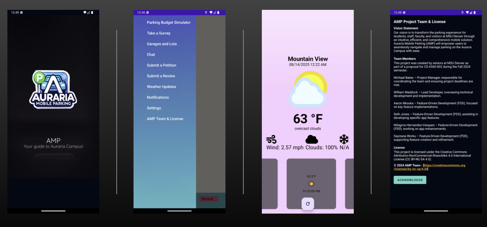

  

From **August 2024 to December 2024**, I served as **Technical Lead** for the **Auraria Mobile Parking (AMP) project**, a Kotlin-based mobile app developed for MSU Denver’s CS4360 senior course as part of my B.S. in Computer Science. AMP streamlines parking for students, staff, faculty, and visitors, reducing stress during busy campus hours.

👉 <a href="https://github.com/willmaddock/CS4360TeamApp" target="_blank" rel="noopener noreferrer"><strong>View the GitHub Repository</strong></a>  
👉 <a href="https://github.com/willmaddock/CS4360TeamApp/blob/main/Docs/docs/User_Guide.md" target="_blank" rel="noopener noreferrer"><strong>View the User Guide</strong></a>

---

### 🔍 Project Highlights

- Led a team of six to build a mobile app in **Kotlin** and **Android Studio**, integrating APIs for real-time parking solutions.
- Managed collaboration via **Git** and **ClickUp**, ensuring high-quality code delivery.
- Tested on Android emulators and physical devices, delivering a polished presentation.
- Designed a scalable app with potential for broader urban mobility applications.

---

### 📦 My Role: Technical Lead

- **Team Management**: Coordinated a team of six using ClickUp and Git, reviewing and merging contributions for seamless integration.
- **Development**: Led implementation of core features, including API integrations and UI optimization.
- **Presentation**: Delivered a comprehensive project showcase to stakeholders.
- **Quality Assurance**: Enforced code reviews and documentation best practices.

This role sharpened my skills in **Agile** and **Feature-Driven Development (FDD)**.

---

### 👥 Team Members and Credits

A collaborative effort with my talented team:

- **Michael Bate**: Project Manager – Coordinated deadlines and assisted with testing.
- **William Maddock** (Me): Technical Lead – Oversaw development and Git management.
- **Aaron Nkouka**: Feature-Driven Development – Key feature implementations.
- **Seth Jones**: Feature-Driven Development – Built specific app features.
- **Milagros Hernandez-Vasquez**: Feature-Driven Development – App enhancements.
- **Sayizana Worku**: Feature-Driven Development – Feature creation and refinement.

Licensed under the <a href="https://creativecommons.org/licenses/by-nc-sa/4.0/" target="_blank" rel="noopener noreferrer">Creative Commons Attribution-NonCommercial-ShareAlike 4.0</a>.

---

### ✨ Key Features

AMP offers unique tools for parking management:

1. **Real-Time Parking Availability**: Find open lots to avoid congestion.
2. **Filter Parking Lots**: Sort by cost, proximity, or availability.
3. **User Reviews**: Gain insights from community feedback.
4. **AI Chatbot**: Instant directions and support.
5. **Parking Budget Simulator**: Estimate costs for budgeting.
6. **Multi-Language Access**: Inclusive for diverse users.
7. **Live Weather Updates**: Weather-based parking choices.
8. **Ball Arena Updates**: Avoid event congestion.

**Integrations**: OpenWeather, Ticketmaster, Google Maps SDK, Google AI Studio, Firebase, ChatGPT.

---

### 🛠️ Technologies Used

- **Language**: Kotlin
- **Environment**: Android Studio
- **Tools**: ClickUp, Git
- **Testing**: Android Studio Emulator, Physical Android Devices
- **Methodologies**: FDD, Agile
- **Documentation**: <a href="https://github.com/willmaddock/CS4360TeamApp/blob/main/Docs/docs/User_Guide.md" target="_blank" rel="noopener noreferrer">User Guide</a>, <a href="https://github.com/willmaddock/CS4360TeamApp/blob/main/README.md" target="_blank" rel="noopener noreferrer">README</a>

---

### 📁 Repository Contents

| Resource | Description |
|----------|-------------|
| <a href="https://github.com/willmaddock/CS4360TeamApp/blob/main/Docs/docs/User_Guide.md" target="_blank" rel="noopener noreferrer">Docs/docs/User_Guide.md</a> | App usage instructions |
| <a href="https://github.com/willmaddock/CS4360TeamApp/blob/main/Docs/docs/API_Reference.md" target="_blank" rel="noopener noreferrer">Docs/docs/API_Reference.md</a> | API endpoints and functionality |
| <a href="https://github.com/willmaddock/CS4360TeamApp/blob/main/Docs/docs/Technical_Documentation.md" target="_blank" rel="noopener noreferrer">Docs/docs/Technical_Documentation.md</a> | Architecture and roles |
| <a href="https://github.com/willmaddock/CS4360TeamApp/tree/main/Docs/docs/Test_Reports" target="_blank" rel="noopener noreferrer">Docs/docs/Test_Reports/</a> | Unit and integration tests |
| <a href="https://github.com/willmaddock/CS4360TeamApp/blob/main/README.md" target="_blank" rel="noopener noreferrer">README.md</a> | Project overview and setup |

📄 Download the presentation: 
  <a href="../../AMP.pdf" target="_blank" rel="noopener noreferrer" download>
    Click here to download AMP (PDF)
  </a>

---

### 📈 Project Rigor

The <a href="https://github.com/willmaddock/CS4360TeamApp" target="_blank" rel="noopener noreferrer">GitHub repository</a> showcases:
- Detailed commit history of team contributions.
- Comprehensive documentation and test reports.
- Setup instructions for local deployment.

**Setup**:
1. Clone: `git clone https://github.com/willmaddock/CS4360TeamApp.git`
2. Configure Firebase and API keys in Android Studio.
3. See <a href="https://github.com/willmaddock/CS4360TeamApp/blob/main/Docs/docs/User_Guide.md" target="_blank" rel="noopener noreferrer">User Guide</a>.

---

### 🔗 Links and Resources

- <a href="https://github.com/willmaddock/CS4360TeamApp" target="_blank" rel="noopener noreferrer">GitHub Repository</a>
- <a href="https://github.com/willmaddock/CS4360TeamApp/blob/main/Docs/docs/User_Guide.md" target="_blank" rel="noopener noreferrer">User Guide</a>
- <a href="https://github.com/willmaddock/CS4360TeamApp/blob/main/README.md" target="_blank" rel="noopener noreferrer">Project README</a>
- <a href="../../AMP.pdf" target="_blank" rel="noopener noreferrer">Presentation PDF</a>

Explore this project to see my leadership and technical skills in action.