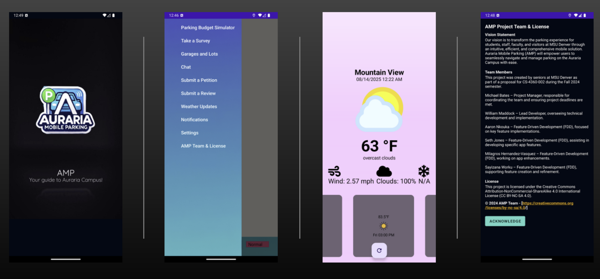

<p style="text-align:center;">
  
</p>

From **August through December 2024**, I served as **Technical Lead** for the **Auraria Mobile Parking (AMP)** project, a six-person Kotlin Android application developed for MSU Denver's CS 4360 course.

The project explored how a mobile application could help students, employees, and visitors find parking information, understand cost and availability, review weather and event conditions, and access support features from one interface.

- <a href="https://github.com/willmaddock/CS4360TeamApp" target="_blank" rel="noopener noreferrer"><strong>View the GitHub repository</strong></a>
- <a href="https://github.com/willmaddock/CS4360TeamApp/blob/main/Docs/docs/User_Guide.md" target="_blank" rel="noopener noreferrer"><strong>View the user guide</strong></a>
- <a href="../../AMP.pdf" target="_blank" rel="noopener noreferrer"><strong>View the presentation</strong></a>

---

## Project Highlights

- Led technical coordination for a six-person team.
- Developed the application in **Kotlin** and **Android Studio**.
- Managed source integration through Git and task coordination through ClickUp.
- Integrated mapping, weather, event, Firebase, and AI-assisted support capabilities documented by the project.
- Reviewed and merged team contributions.
- Coordinated emulator and physical-device testing.
- Helped prepare technical documentation and the final presentation.
- Applied Agile and Feature-Driven Development practices.

---

## My Role: Technical Lead

My responsibilities included:

- Supporting architecture and feature planning
- Coordinating team contributions
- Managing Git integration and merge work
- Reviewing implementation consistency
- Assisting with API and interface development
- Tracking work through ClickUp
- Supporting testing and troubleshooting
- Maintaining technical documentation
- Presenting the completed application

---

## Team

- **Michael Bate** — Project Manager
- **William Maddock** — Technical Lead
- **Aaron Nkouka** — Feature Development
- **Seth Jones** — Feature Development
- **Milagros Hernandez-Vasquez** — Feature Development
- **Sayizana Worku** — Feature Development

---

## Application Features

The project documentation describes features including:

1. Parking availability and lot information
2. Filtering by cost, proximity, or availability
3. User reviews
4. AI-assisted directions and support
5. Parking-budget estimates
6. Multi-language access
7. Weather information
8. Event-awareness features for nearby congestion

---

## Technology Stack

| Area | Technologies |
|---|---|
| Language | Kotlin |
| Environment | Android Studio |
| Services and APIs | Firebase, Google Maps SDK, OpenWeather, Ticketmaster, AI-assisted support services |
| Collaboration | Git, GitHub, ClickUp |
| Testing | Android Emulator, physical Android devices |
| Methods | Agile, Feature-Driven Development |

---

## Documentation

- <a href="https://github.com/willmaddock/CS4360TeamApp/blob/main/Docs/docs/User_Guide.md" target="_blank" rel="noopener noreferrer">User Guide</a>
- <a href="https://github.com/willmaddock/CS4360TeamApp/blob/main/Docs/docs/API_Reference.md" target="_blank" rel="noopener noreferrer">API Reference</a>
- <a href="https://github.com/willmaddock/CS4360TeamApp/blob/main/Docs/docs/Technical_Documentation.md" target="_blank" rel="noopener noreferrer">Technical Documentation</a>
- <a href="https://github.com/willmaddock/CS4360TeamApp/tree/main/Docs/docs/Test_Reports" target="_blank" rel="noopener noreferrer">Test Reports</a>
- <a href="https://github.com/willmaddock/CS4360TeamApp/blob/main/README.md" target="_blank" rel="noopener noreferrer">Project README</a>

---

## Local Setup

```bash
git clone https://github.com/willmaddock/CS4360TeamApp.git
```

Open the project in Android Studio and follow the repository documentation to configure Firebase and required API keys.
